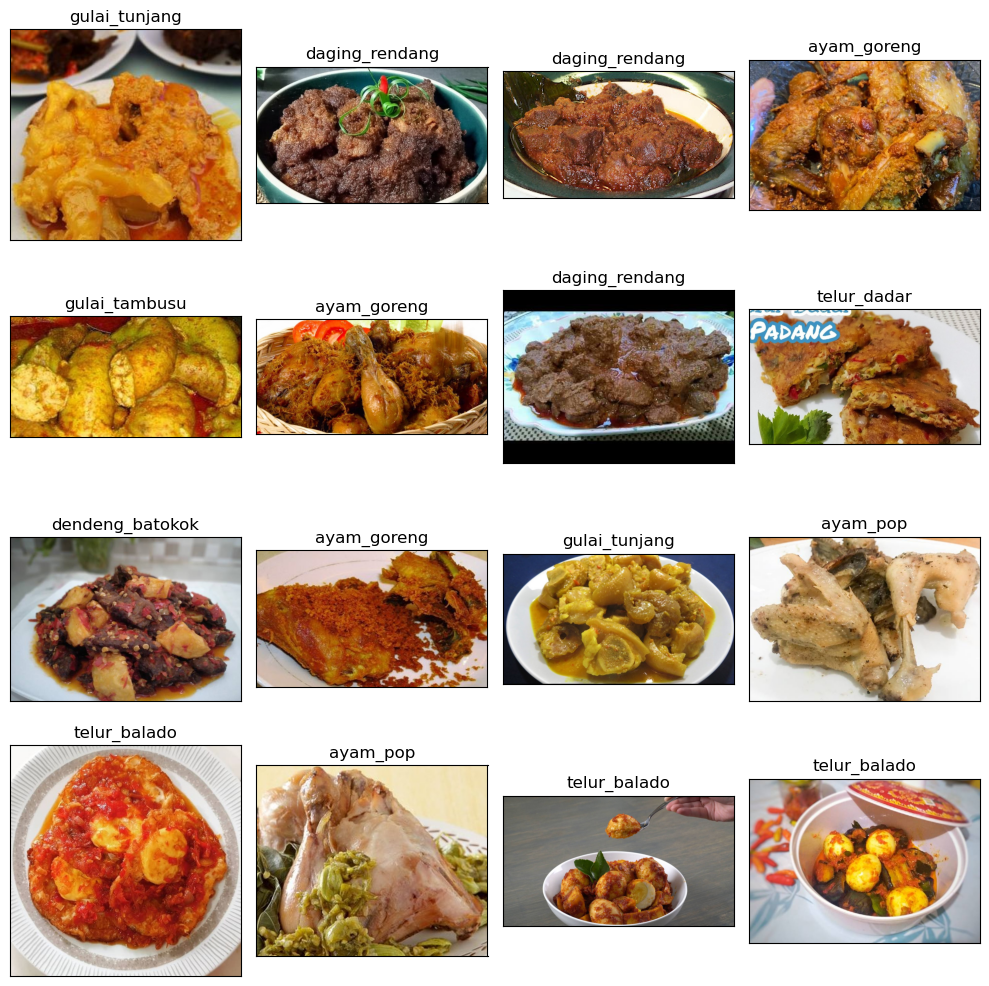
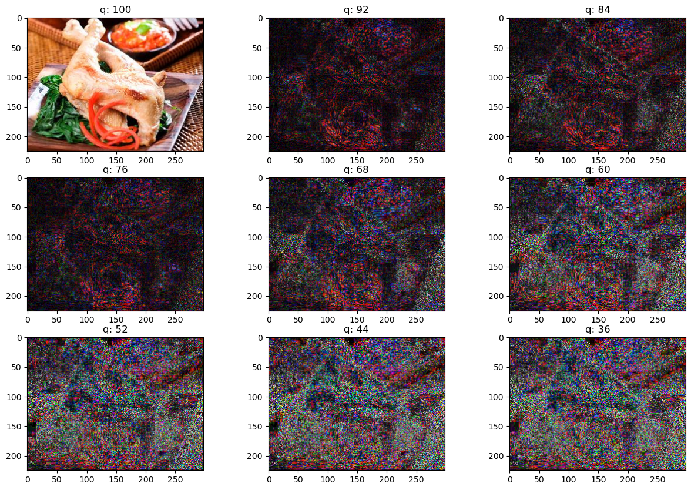
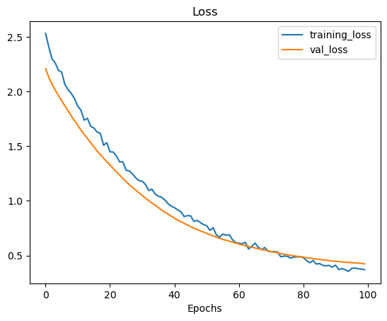
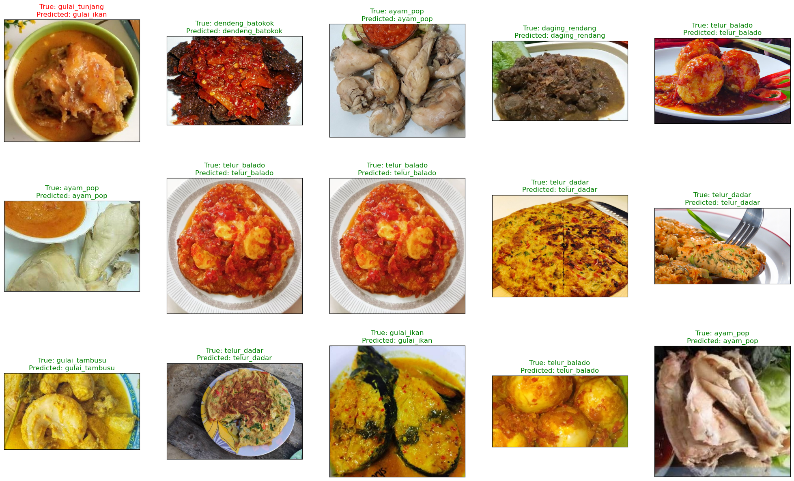
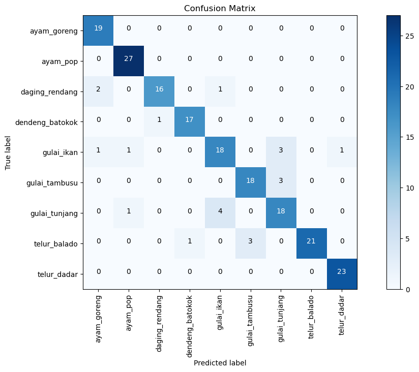

.. code:: ipython3

    # This Python 3 environment comes with many helpful analytics libraries installed
    # It is defined by the kaggle/python Docker image: https://github.com/kaggle/docker-python
    # For example, here's several helpful packages to load
    
    import numpy as np # linear algebra
    import pandas as pd # data processing, CSV file I/O (e.g. pd.read_csv)
    
    # Input data files are available in the read-only "../input/" directory
    # For example, running this (by clicking run or pressing Shift+Enter) will list all files under the input directory
    
    import os
    for dirname, _, filenames in os.walk('/kaggle/input'):
        for filename in filenames:
            print(os.path.join(dirname, filename))
    
    # You can write up to 20GB to the current directory (/kaggle/working/) that gets preserved as output when you create a version using "Save & Run All" 
    # You can also write temporary files to /kaggle/temp/, but they won't be saved outside of the current session

.. parsed-literal::

    /kaggle/input/padangfood/dataset_padang_food/gulai_tambusu/gulai_tambusu (95).jpg
    /kaggle/input/padangfood/dataset_padang_food/gulai_tambusu/gulai_tambusu (26).jpg
    /kaggle/input/padangfood/dataset_padang_food/gulai_tambusu/gulai_tambusu (29).jpg
    /kaggle/input/padangfood/dataset_padang_food/gulai_tambusu/gulai_tambusu (30).jpg
    /kaggle/input/padangfood/dataset_padang_food/gulai_tambusu/gulai_tambusu (65).jpg
    /kaggle/input/padangfood/dataset_padang_food/gulai_tambusu/gulai_tambusu (15).jpg
    /kaggle/input/padangfood/dataset_padang_food/gulai_tambusu/gulai_tambusu (7).jpg
    /kaggle/input/padangfood/dataset_padang_food/gulai_tambusu/gulai_tambusu (10).jpg
    /kaggle/input/padangfood/dataset_padang_food/gulai_tambusu/gulai_tambusu (70).jpg
    /kaggle/input/padangfood/dataset_padang_food/gulai_tambusu/gulai_tambusu (88).jpg
    /kaggle/input/padangfood/dataset_padang_food/gulai_tambusu/gulai_tambusu (12).jpg
    /kaggle/input/padangfood/dataset_padang_food/gulai_tambusu/gulai_tambusu (66).jpg
    /kaggle/input/padangfood/dataset_padang_food/gulai_tambusu/gulai_tambusu (25).jpg
    /kaggle/input/padangfood/dataset_padang_food/gulai_tambusu/gulai_tambusu (96).jpg
    /kaggle/input/padangfood/dataset_padang_food/gulai_tambusu/gulai_tambusu (51).jpg
    /kaggle/input/padangfood/dataset_padang_food/gulai_tambusu/gulai_tambusu (21).jpg
    /kaggle/input/padangfood/dataset_padang_food/gulai_tambusu/gulai_tambusu (90).jpg
    /kaggle/input/padangfood/dataset_padang_food/gulai_tambusu/gulai_tambusu (14).jpg
    /kaggle/input/padangfood/dataset_padang_food/gulai_tambusu/gulai_tambusu (92).jpg
    /kaggle/input/padangfood/dataset_padang_food/gulai_tambusu/gulai_tambusu (38).jpg
    /kaggle/input/padangfood/dataset_padang_food/gulai_tambusu/gulai_tambusu (79).jpg
    /kaggle/input/padangfood/dataset_padang_food/gulai_tambusu/gulai_tambusu (22).jpg
    /kaggle/input/padangfood/dataset_padang_food/gulai_tambusu/gulai_tambusu (16).jpg
    /kaggle/input/padangfood/dataset_padang_food/gulai_tambusu/gulai_tambusu (93).jpg
    /kaggle/input/padangfood/dataset_padang_food/gulai_tambusu/gulai_tambusu (83).jpg
    /kaggle/input/padangfood/dataset_padang_food/gulai_tambusu/gulai_tambusu (23).jpg
    /kaggle/input/padangfood/dataset_padang_food/gulai_tambusu/gulai_tambusu (18).jpg
    /kaggle/input/padangfood/dataset_padang_food/gulai_tambusu/gulai_tambusu (36).jpg
    /kaggle/input/padangfood/dataset_padang_food/gulai_tambusu/gulai_tambusu (57).jpg
    /kaggle/input/padangfood/dataset_padang_food/gulai_tambusu/gulai_tambusu (81).jpg
    /kaggle/input/padangfood/dataset_padang_food/gulai_tambusu/gulai_tambusu (8).jpg
    /kaggle/input/padangfood/dataset_padang_food/gulai_tambusu/gulai_tambusu (61).jpg
    /kaggle/input/padangfood/dataset_padang_food/gulai_tambusu/gulai_tambusu (84).jpg
    /kaggle/input/padangfood/dataset_padang_food/gulai_tambusu/gulai_tambusu (98).jpg
    /kaggle/input/padangfood/dataset_padang_food/gulai_tambusu/gulai_tambusu (6).jpg
    /kaggle/input/padangfood/dataset_padang_food/gulai_tambusu/gulai_tambusu (69).jpg
    /kaggle/input/padangfood/dataset_padang_food/gulai_tambusu/gulai_tambusu (63).jpg
    /kaggle/input/padangfood/dataset_padang_food/gulai_tambusu/gulai_tambusu (4).jpg
    /kaggle/input/padangfood/dataset_padang_food/gulai_tambusu/gulai_tambusu (46).jpg
    /kaggle/input/padangfood/dataset_padang_food/gulai_tambusu/gulai_tambusu (103).jpg
    /kaggle/input/padangfood/dataset_padang_food/gulai_tambusu/gulai_tambusu (80).jpg
    /kaggle/input/padangfood/dataset_padang_food/gulai_tambusu/gulai_tambusu (27).jpg
    /kaggle/input/padangfood/dataset_padang_food/gulai_tambusu/gulai_tambusu (85).jpg
    /kaggle/input/padangfood/dataset_padang_food/gulai_tambusu/gulai_tambusu (77).jpg
    /kaggle/input/padangfood/dataset_padang_food/gulai_tambusu/gulai_tambusu (32).jpg
    /kaggle/input/padangfood/dataset_padang_food/gulai_tambusu/gulai_tambusu (1).jpg
    /kaggle/input/padangfood/dataset_padang_food/gulai_tambusu/gulai_tambusu (40).jpg
    /kaggle/input/padangfood/dataset_padang_food/gulai_tambusu/gulai_tambusu (67).jpg
    /kaggle/input/padangfood/dataset_padang_food/gulai_tambusu/gulai_tambusu (44).jpg
    /kaggle/input/padangfood/dataset_padang_food/gulai_tambusu/gulai_tambusu (59).jpg
    /kaggle/input/padangfood/dataset_padang_food/gulai_tambusu/gulai_tambusu (48).jpg
    /kaggle/input/padangfood/dataset_padang_food/gulai_tambusu/gulai_tambusu (56).jpg
    /kaggle/input/padangfood/dataset_padang_food/gulai_tambusu/gulai_tambusu (71).jpg
    /kaggle/input/padangfood/dataset_padang_food/gulai_tambusu/gulai_tambusu (43).jpg
    /kaggle/input/padangfood/dataset_padang_food/gulai_tambusu/gulai_tambusu (2).jpg
    /kaggle/input/padangfood/dataset_padang_food/gulai_tambusu/gulai_tambusu (89).jpg
    /kaggle/input/padangfood/dataset_padang_food/gulai_tambusu/gulai_tambusu (37).jpg
    /kaggle/input/padangfood/dataset_padang_food/gulai_tambusu/gulai_tambusu (39).jpg
    /kaggle/input/padangfood/dataset_padang_food/gulai_tambusu/gulai_tambusu (58).jpg
    /kaggle/input/padangfood/dataset_padang_food/gulai_tambusu/gulai_tambusu (82).jpg
    /kaggle/input/padangfood/dataset_padang_food/gulai_tambusu/gulai_tambusu (50).jpg
    /kaggle/input/padangfood/dataset_padang_food/gulai_tambusu/gulai_tambusu (53).jpg
    /kaggle/input/padangfood/dataset_padang_food/gulai_tambusu/gulai_tambusu (35).jpg
    /kaggle/input/padangfood/dataset_padang_food/gulai_tambusu/gulai_tambusu (31).jpg
    /kaggle/input/padangfood/dataset_padang_food/gulai_tambusu/gulai_tambusu (91).jpg
    /kaggle/input/padangfood/dataset_padang_food/gulai_tambusu/gulai_tambusu (62).jpg
    /kaggle/input/padangfood/dataset_padang_food/gulai_tambusu/gulai_tambusu (68).jpg
    /kaggle/input/padangfood/dataset_padang_food/gulai_tambusu/gulai_tambusu (19).jpg
    /kaggle/input/padangfood/dataset_padang_food/gulai_tambusu/gulai_tambusu (64).JPG
    /kaggle/input/padangfood/dataset_padang_food/gulai_tambusu/gulai_tambusu (45).jpg
    /kaggle/input/padangfood/dataset_padang_food/gulai_tambusu/gulai_tambusu (42).jpg
    /kaggle/input/padangfood/dataset_padang_food/gulai_tambusu/gulai_tambusu (74).jpg
    /kaggle/input/padangfood/dataset_padang_food/gulai_tambusu/gulai_tambusu (52).jpg
    /kaggle/input/padangfood/dataset_padang_food/gulai_tambusu/gulai_tambusu (101).jpg
    /kaggle/input/padangfood/dataset_padang_food/gulai_tambusu/gulai_tambusu (72).jpg
    /kaggle/input/padangfood/dataset_padang_food/gulai_tambusu/gulai_tambusu (86).JPG
    /kaggle/input/padangfood/dataset_padang_food/gulai_tambusu/gulai_tambusu (94).jpg
    /kaggle/input/padangfood/dataset_padang_food/gulai_tambusu/gulai_tambusu (102).jpg
    /kaggle/input/padangfood/dataset_padang_food/gulai_tambusu/gulai_tambusu (60).jpg
    /kaggle/input/padangfood/dataset_padang_food/gulai_tambusu/gulai_tambusu (28).jpg
    /kaggle/input/padangfood/dataset_padang_food/gulai_tambusu/gulai_tambusu (34).jpg
    /kaggle/input/padangfood/dataset_padang_food/gulai_tambusu/gulai_tambusu (41).jpg
    /kaggle/input/padangfood/dataset_padang_food/gulai_tambusu/gulai_tambusu (73).jpg
    /kaggle/input/padangfood/dataset_padang_food/gulai_tambusu/gulai_tambusu (24).jpg
    /kaggle/input/padangfood/dataset_padang_food/gulai_tambusu/gulai_tambusu (87).jpg
    /kaggle/input/padangfood/dataset_padang_food/gulai_tambusu/gulai_tambusu (47).jpg
    /kaggle/input/padangfood/dataset_padang_food/gulai_tambusu/gulai_tambusu (9).jpg
    /kaggle/input/padangfood/dataset_padang_food/gulai_tambusu/gulai_tambusu (17).jpg
    /kaggle/input/padangfood/dataset_padang_food/gulai_tambusu/gulai_tambusu (5).jpg
    /kaggle/input/padangfood/dataset_padang_food/gulai_tambusu/gulai_tambusu (78).jpg
    /kaggle/input/padangfood/dataset_padang_food/gulai_tambusu/gulai_tambusu (33).jpg
    /kaggle/input/padangfood/dataset_padang_food/gulai_tambusu/gulai_tambusu (76).jpg
    /kaggle/input/padangfood/dataset_padang_food/gulai_tambusu/gulai_tambusu (75).JPG
    /kaggle/input/padangfood/dataset_padang_food/gulai_tambusu/gulai_tambusu (11).jpg
    /kaggle/input/padangfood/dataset_padang_food/gulai_tambusu/gulai_tambusu (13).jpg
    /kaggle/input/padangfood/dataset_padang_food/gulai_tambusu/gulai_tambusu (54).jpg
    /kaggle/input/padangfood/dataset_padang_food/gulai_tambusu/gulai_tambusu (20).jpg
    /kaggle/input/padangfood/dataset_padang_food/gulai_tambusu/gulai_tambusu (99).jpg
    /kaggle/input/padangfood/dataset_padang_food/gulai_tambusu/gulai_tambusu (97).jpg
    /kaggle/input/padangfood/dataset_padang_food/gulai_tambusu/gulai_tambusu (100).jpg
    /kaggle/input/padangfood/dataset_padang_food/gulai_tambusu/gulai_tambusu (49).jpg
    /kaggle/input/padangfood/dataset_padang_food/gulai_tambusu/gulai_tambusu (55).jpg
    /kaggle/input/padangfood/dataset_padang_food/gulai_tambusu/gulai_tambusu (3).jpg
    /kaggle/input/padangfood/dataset_padang_food/dendeng_batokok/dendeng_batokok (25).jpg
    /kaggle/input/padangfood/dataset_padang_food/dendeng_batokok/dendeng_batokok (48).jpg
    /kaggle/input/padangfood/dataset_padang_food/dendeng_batokok/dendeng_batokok (28).jpg
    /kaggle/input/padangfood/dataset_padang_food/dendeng_batokok/dendeng_batokok (4).jpg
    /kaggle/input/padangfood/dataset_padang_food/dendeng_batokok/dendeng_batokok (67).jpg
    /kaggle/input/padangfood/dataset_padang_food/dendeng_batokok/dendeng_batokok (82).jpg
    /kaggle/input/padangfood/dataset_padang_food/dendeng_batokok/dendeng_batokok (26).jpg
    /kaggle/input/padangfood/dataset_padang_food/dendeng_batokok/dendeng_batokok (57).jpg
    /kaggle/input/padangfood/dataset_padang_food/dendeng_batokok/dendeng_batokok (78).jpg
    /kaggle/input/padangfood/dataset_padang_food/dendeng_batokok/dendeng_batokok (41).jpg
    /kaggle/input/padangfood/dataset_padang_food/dendeng_batokok/dendeng_batokok (96).jpg
    /kaggle/input/padangfood/dataset_padang_food/dendeng_batokok/dendeng_batokok (23).jpg
    /kaggle/input/padangfood/dataset_padang_food/dendeng_batokok/dendeng_batokok (94).jpg
    /kaggle/input/padangfood/dataset_padang_food/dendeng_batokok/dendeng_batokok (106).jpg
    /kaggle/input/padangfood/dataset_padang_food/dendeng_batokok/dendeng_batokok (39).jpg
    /kaggle/input/padangfood/dataset_padang_food/dendeng_batokok/dendeng_batokok (9).jpg
    /kaggle/input/padangfood/dataset_padang_food/dendeng_batokok/dendeng_batokok (65).jpg
    /kaggle/input/padangfood/dataset_padang_food/dendeng_batokok/dendeng_batokok (38).jpg
    /kaggle/input/padangfood/dataset_padang_food/dendeng_batokok/dendeng_batokok (75).jpg
    /kaggle/input/padangfood/dataset_padang_food/dendeng_batokok/dendeng_batokok (22).jpg
    /kaggle/input/padangfood/dataset_padang_food/dendeng_batokok/dendeng_batokok (81).jpg
    /kaggle/input/padangfood/dataset_padang_food/dendeng_batokok/dendeng_batokok (29).jpg
    /kaggle/input/padangfood/dataset_padang_food/dendeng_batokok/dendeng_batokok (46).jpg
    /kaggle/input/padangfood/dataset_padang_food/dendeng_batokok/dendeng_batokok (8).jpg
    /kaggle/input/padangfood/dataset_padang_food/dendeng_batokok/dendeng_batokok (11).jpg
    /kaggle/input/padangfood/dataset_padang_food/dendeng_batokok/dendeng_batokok (20).jpg
    /kaggle/input/padangfood/dataset_padang_food/dendeng_batokok/dendeng_batokok (34).jpg
    /kaggle/input/padangfood/dataset_padang_food/dendeng_batokok/dendeng_batokok (99).jpg
    /kaggle/input/padangfood/dataset_padang_food/dendeng_batokok/dendeng_batokok (45).jpg
    /kaggle/input/padangfood/dataset_padang_food/dendeng_batokok/dendeng_batokok (56).jpg
    /kaggle/input/padangfood/dataset_padang_food/dendeng_batokok/dendeng_batokok (84).jpg
    /kaggle/input/padangfood/dataset_padang_food/dendeng_batokok/dendeng_batokok (7).jpg
    /kaggle/input/padangfood/dataset_padang_food/dendeng_batokok/dendeng_batokok (76).jpg
    /kaggle/input/padangfood/dataset_padang_food/dendeng_batokok/dendeng_batokok (51).jpg
    /kaggle/input/padangfood/dataset_padang_food/dendeng_batokok/dendeng_batokok (52).jpg
    /kaggle/input/padangfood/dataset_padang_food/dendeng_batokok/dendeng_batokok (24).jpg
    /kaggle/input/padangfood/dataset_padang_food/dendeng_batokok/dendeng_batokok (58).jpg
    /kaggle/input/padangfood/dataset_padang_food/dendeng_batokok/dendeng_batokok (33).jpg
    /kaggle/input/padangfood/dataset_padang_food/dendeng_batokok/dendeng_batokok (55).jpg
    /kaggle/input/padangfood/dataset_padang_food/dendeng_batokok/dendeng_batokok (44).jpg
    /kaggle/input/padangfood/dataset_padang_food/dendeng_batokok/dendeng_batokok (61).jpg
    /kaggle/input/padangfood/dataset_padang_food/dendeng_batokok/dendeng_batokok (6).jpg
    /kaggle/input/padangfood/dataset_padang_food/dendeng_batokok/dendeng_batokok (102).jpg
    /kaggle/input/padangfood/dataset_padang_food/dendeng_batokok/dendeng_batokok (31).jpg
    /kaggle/input/padangfood/dataset_padang_food/dendeng_batokok/dendeng_batokok (108).jpg
    /kaggle/input/padangfood/dataset_padang_food/dendeng_batokok/dendeng_batokok (1).jpg
    /kaggle/input/padangfood/dataset_padang_food/dendeng_batokok/dendeng_batokok (107).jpg
    /kaggle/input/padangfood/dataset_padang_food/dendeng_batokok/dendeng_batokok (19).jpg
    /kaggle/input/padangfood/dataset_padang_food/dendeng_batokok/dendeng_batokok (69).jpg
    /kaggle/input/padangfood/dataset_padang_food/dendeng_batokok/dendeng_batokok (47).jpg
    /kaggle/input/padangfood/dataset_padang_food/dendeng_batokok/dendeng_batokok (14).jpg
    /kaggle/input/padangfood/dataset_padang_food/dendeng_batokok/dendeng_batokok (73).jpg
    /kaggle/input/padangfood/dataset_padang_food/dendeng_batokok/dendeng_batokok (60).jpg
    /kaggle/input/padangfood/dataset_padang_food/dendeng_batokok/dendeng_batokok (27).jpg
    /kaggle/input/padangfood/dataset_padang_food/dendeng_batokok/dendeng_batokok (77).jpg
    /kaggle/input/padangfood/dataset_padang_food/dendeng_batokok/dendeng_batokok (30).jpg
    /kaggle/input/padangfood/dataset_padang_food/dendeng_batokok/dendeng_batokok (37).jpg
    /kaggle/input/padangfood/dataset_padang_food/dendeng_batokok/dendeng_batokok (105).jpg
    /kaggle/input/padangfood/dataset_padang_food/dendeng_batokok/dendeng_batokok (90).jpg
    /kaggle/input/padangfood/dataset_padang_food/dendeng_batokok/dendeng_batokok (15).jpg
    /kaggle/input/padangfood/dataset_padang_food/dendeng_batokok/dendeng_batokok (68).jpg
    /kaggle/input/padangfood/dataset_padang_food/dendeng_batokok/dendeng_batokok (49).jpg
    /kaggle/input/padangfood/dataset_padang_food/dendeng_batokok/dendeng_batokok (18).jpg
    /kaggle/input/padangfood/dataset_padang_food/dendeng_batokok/dendeng_batokok (87).jpg
    /kaggle/input/padangfood/dataset_padang_food/dendeng_batokok/dendeng_batokok (59).jpg
    /kaggle/input/padangfood/dataset_padang_food/dendeng_batokok/dendeng_batokok (89).jpg
    /kaggle/input/padangfood/dataset_padang_food/dendeng_batokok/dendeng_batokok (109).jpg
    /kaggle/input/padangfood/dataset_padang_food/dendeng_batokok/dendeng_batokok (12).jpg
    /kaggle/input/padangfood/dataset_padang_food/dendeng_batokok/dendeng_batokok (2).jpg
    /kaggle/input/padangfood/dataset_padang_food/dendeng_batokok/dendeng_batokok (50).jpg
    /kaggle/input/padangfood/dataset_padang_food/dendeng_batokok/dendeng_batokok (21).jpg
    /kaggle/input/padangfood/dataset_padang_food/dendeng_batokok/dendeng_batokok (54).jpg
    /kaggle/input/padangfood/dataset_padang_food/dendeng_batokok/dendeng_batokok (16).jpg
    /kaggle/input/padangfood/dataset_padang_food/dendeng_batokok/dendeng_batokok (101).jpg
    /kaggle/input/padangfood/dataset_padang_food/dendeng_batokok/dendeng_batokok (40).jpg
    /kaggle/input/padangfood/dataset_padang_food/dendeng_batokok/dendeng_batokok (72).jpg
    /kaggle/input/padangfood/dataset_padang_food/dendeng_batokok/dendeng_batokok (95).jpg
    /kaggle/input/padangfood/dataset_padang_food/dendeng_batokok/dendeng_batokok (66).jpg
    /kaggle/input/padangfood/dataset_padang_food/dendeng_batokok/dendeng_batokok (64).jpg
    /kaggle/input/padangfood/dataset_padang_food/dendeng_batokok/dendeng_batokok (80).jpg
    /kaggle/input/padangfood/dataset_padang_food/dendeng_batokok/dendeng_batokok (88).jpg
    /kaggle/input/padangfood/dataset_padang_food/dendeng_batokok/dendeng_batokok (91).jpg
    /kaggle/input/padangfood/dataset_padang_food/dendeng_batokok/dendeng_batokok (86).jpg
    /kaggle/input/padangfood/dataset_padang_food/dendeng_batokok/dendeng_batokok (93).jpg
    /kaggle/input/padangfood/dataset_padang_food/dendeng_batokok/dendeng_batokok (13).jpg
    /kaggle/input/padangfood/dataset_padang_food/dendeng_batokok/dendeng_batokok (85).jpg
    /kaggle/input/padangfood/dataset_padang_food/dendeng_batokok/dendeng_batokok (100).jpg
    /kaggle/input/padangfood/dataset_padang_food/dendeng_batokok/dendeng_batokok (92).jpg
    /kaggle/input/padangfood/dataset_padang_food/dendeng_batokok/dendeng_batokok (74).jpg
    /kaggle/input/padangfood/dataset_padang_food/dendeng_batokok/dendeng_batokok (104).jpg
    /kaggle/input/padangfood/dataset_padang_food/dendeng_batokok/dendeng_batokok (53).jpg
    /kaggle/input/padangfood/dataset_padang_food/dendeng_batokok/dendeng_batokok (35).jpg
    /kaggle/input/padangfood/dataset_padang_food/dendeng_batokok/dendeng_batokok (63).jpg
    /kaggle/input/padangfood/dataset_padang_food/dendeng_batokok/dendeng_batokok (62).jpg
    /kaggle/input/padangfood/dataset_padang_food/dendeng_batokok/dendeng_batokok (42).jpg
    /kaggle/input/padangfood/dataset_padang_food/dendeng_batokok/dendeng_batokok (3).jpg
    /kaggle/input/padangfood/dataset_padang_food/dendeng_batokok/dendeng_batokok (32).jpg
    /kaggle/input/padangfood/dataset_padang_food/dendeng_batokok/dendeng_batokok (110).jpg
    /kaggle/input/padangfood/dataset_padang_food/dendeng_batokok/dendeng_batokok (98).jpg
    /kaggle/input/padangfood/dataset_padang_food/dendeng_batokok/dendeng_batokok (71).jpg
    /kaggle/input/padangfood/dataset_padang_food/dendeng_batokok/dendeng_batokok (17).jpg
    /kaggle/input/padangfood/dataset_padang_food/dendeng_batokok/dendeng_batokok (79).jpg
    /kaggle/input/padangfood/dataset_padang_food/dendeng_batokok/dendeng_batokok (103).jpg
    /kaggle/input/padangfood/dataset_padang_food/dendeng_batokok/dendeng_batokok (83).jpg
    /kaggle/input/padangfood/dataset_padang_food/dendeng_batokok/dendeng_batokok (97).jpg
    /kaggle/input/padangfood/dataset_padang_food/dendeng_batokok/dendeng_batokok (10).jpg
    /kaggle/input/padangfood/dataset_padang_food/dendeng_batokok/dendeng_batokok (36).jpg
    /kaggle/input/padangfood/dataset_padang_food/dendeng_batokok/dendeng_batokok (43).jpg
    /kaggle/input/padangfood/dataset_padang_food/dendeng_batokok/dendeng_batokok (5).jpg
    /kaggle/input/padangfood/dataset_padang_food/ayam_pop/ayam_pop (49).jpg
    /kaggle/input/padangfood/dataset_padang_food/ayam_pop/ayam_pop (114).jpg
    /kaggle/input/padangfood/dataset_padang_food/ayam_pop/ayam_pop (53).jpg
    /kaggle/input/padangfood/dataset_padang_food/ayam_pop/ayam_pop (22).jpg
    /kaggle/input/padangfood/dataset_padang_food/ayam_pop/ayam_pop (109).jpg
    /kaggle/input/padangfood/dataset_padang_food/ayam_pop/ayam_pop (99).jpg
    /kaggle/input/padangfood/dataset_padang_food/ayam_pop/ayam_pop (112).jpg
    /kaggle/input/padangfood/dataset_padang_food/ayam_pop/ayam_pop (51).jpg
    /kaggle/input/padangfood/dataset_padang_food/ayam_pop/ayam_pop (70).jpg
    /kaggle/input/padangfood/dataset_padang_food/ayam_pop/ayam_pop (68).JPG
    /kaggle/input/padangfood/dataset_padang_food/ayam_pop/ayam_pop (46).jpg
    /kaggle/input/padangfood/dataset_padang_food/ayam_pop/ayam_pop (6).jpg
    /kaggle/input/padangfood/dataset_padang_food/ayam_pop/ayam_pop (45).jpg
    /kaggle/input/padangfood/dataset_padang_food/ayam_pop/ayam_pop (77).jpg
    /kaggle/input/padangfood/dataset_padang_food/ayam_pop/ayam_pop (84).jpg
    /kaggle/input/padangfood/dataset_padang_food/ayam_pop/ayam_pop (55).jpg
    /kaggle/input/padangfood/dataset_padang_food/ayam_pop/ayam_pop (29).jpg
    /kaggle/input/padangfood/dataset_padang_food/ayam_pop/ayam_pop (23).jpg
    /kaggle/input/padangfood/dataset_padang_food/ayam_pop/ayam_pop (75).jpg
    /kaggle/input/padangfood/dataset_padang_food/ayam_pop/ayam_pop (7).jpg
    /kaggle/input/padangfood/dataset_padang_food/ayam_pop/ayam_pop (57).jpg
    /kaggle/input/padangfood/dataset_padang_food/ayam_pop/ayam_pop (30).jpg
    /kaggle/input/padangfood/dataset_padang_food/ayam_pop/ayam_pop (83).jpg
    /kaggle/input/padangfood/dataset_padang_food/ayam_pop/ayam_pop (62).jpg
    /kaggle/input/padangfood/dataset_padang_food/ayam_pop/ayam_pop (9).jpg
    /kaggle/input/padangfood/dataset_padang_food/ayam_pop/ayam_pop (20).jpg
    /kaggle/input/padangfood/dataset_padang_food/ayam_pop/ayam_pop (107).jpg
    /kaggle/input/padangfood/dataset_padang_food/ayam_pop/ayam_pop (14).jpg
    /kaggle/input/padangfood/dataset_padang_food/ayam_pop/ayam_pop (69).JPG
    /kaggle/input/padangfood/dataset_padang_food/ayam_pop/ayam_pop (61).jpg
    /kaggle/input/padangfood/dataset_padang_food/ayam_pop/ayam_pop (56).jpg
    /kaggle/input/padangfood/dataset_padang_food/ayam_pop/ayam_pop (76).jpg
    /kaggle/input/padangfood/dataset_padang_food/ayam_pop/ayam_pop (50).jpg
    /kaggle/input/padangfood/dataset_padang_food/ayam_pop/ayam_pop (94).jpg
    /kaggle/input/padangfood/dataset_padang_food/ayam_pop/ayam_pop (24).JPG
    /kaggle/input/padangfood/dataset_padang_food/ayam_pop/ayam_pop (102).jpg
    /kaggle/input/padangfood/dataset_padang_food/ayam_pop/ayam_pop (67).jpg
    /kaggle/input/padangfood/dataset_padang_food/ayam_pop/ayam_pop (91).jpg
    /kaggle/input/padangfood/dataset_padang_food/ayam_pop/ayam_pop (63).jpg
    /kaggle/input/padangfood/dataset_padang_food/ayam_pop/ayam_pop (28).jpg
    /kaggle/input/padangfood/dataset_padang_food/ayam_pop/ayam_pop (95).jpg
    /kaggle/input/padangfood/dataset_padang_food/ayam_pop/ayam_pop (3).jpg
    /kaggle/input/padangfood/dataset_padang_food/ayam_pop/ayam_pop (110).jpg
    /kaggle/input/padangfood/dataset_padang_food/ayam_pop/ayam_pop (18).jpg
    /kaggle/input/padangfood/dataset_padang_food/ayam_pop/ayam_pop (97).jpg
    /kaggle/input/padangfood/dataset_padang_food/ayam_pop/ayam_pop (17).jpg
    /kaggle/input/padangfood/dataset_padang_food/ayam_pop/ayam_pop (90).jpg
    /kaggle/input/padangfood/dataset_padang_food/ayam_pop/ayam_pop (27).jpg
    /kaggle/input/padangfood/dataset_padang_food/ayam_pop/ayam_pop (48).jpg
    /kaggle/input/padangfood/dataset_padang_food/ayam_pop/ayam_pop (78).jpg
    /kaggle/input/padangfood/dataset_padang_food/ayam_pop/ayam_pop (74).jpg
    /kaggle/input/padangfood/dataset_padang_food/ayam_pop/ayam_pop (41).jpg
    /kaggle/input/padangfood/dataset_padang_food/ayam_pop/ayam_pop (85).jpg
    /kaggle/input/padangfood/dataset_padang_food/ayam_pop/ayam_pop (13).jpg
    /kaggle/input/padangfood/dataset_padang_food/ayam_pop/ayam_pop (31).jpg
    /kaggle/input/padangfood/dataset_padang_food/ayam_pop/ayam_pop (16).jpg
    /kaggle/input/padangfood/dataset_padang_food/ayam_pop/ayam_pop (59).jpg
    /kaggle/input/padangfood/dataset_padang_food/ayam_pop/ayam_pop (33).jpg
    /kaggle/input/padangfood/dataset_padang_food/ayam_pop/ayam_pop (11).jpg
    /kaggle/input/padangfood/dataset_padang_food/ayam_pop/ayam_pop (89).jpg
    /kaggle/input/padangfood/dataset_padang_food/ayam_pop/ayam_pop (32).jpg
    /kaggle/input/padangfood/dataset_padang_food/ayam_pop/ayam_pop (92).jpg
    /kaggle/input/padangfood/dataset_padang_food/ayam_pop/ayam_pop (35).jpg
    /kaggle/input/padangfood/dataset_padang_food/ayam_pop/ayam_pop (43).jpg
    /kaggle/input/padangfood/dataset_padang_food/ayam_pop/ayam_pop (103).jpg
    /kaggle/input/padangfood/dataset_padang_food/ayam_pop/ayam_pop (42).jpg
    /kaggle/input/padangfood/dataset_padang_food/ayam_pop/ayam_pop (5).jpg
    /kaggle/input/padangfood/dataset_padang_food/ayam_pop/ayam_pop (80).jpg
    /kaggle/input/padangfood/dataset_padang_food/ayam_pop/ayam_pop (72).jpg
    /kaggle/input/padangfood/dataset_padang_food/ayam_pop/ayam_pop (64).jpg
    /kaggle/input/padangfood/dataset_padang_food/ayam_pop/ayam_pop (71).jpg
    /kaggle/input/padangfood/dataset_padang_food/ayam_pop/ayam_pop (73).JPG
    /kaggle/input/padangfood/dataset_padang_food/ayam_pop/ayam_pop (54).jpg
    /kaggle/input/padangfood/dataset_padang_food/ayam_pop/ayam_pop (66).jpg
    /kaggle/input/padangfood/dataset_padang_food/ayam_pop/ayam_pop (65).jpg
    /kaggle/input/padangfood/dataset_padang_food/ayam_pop/ayam_pop (58).jpg
    /kaggle/input/padangfood/dataset_padang_food/ayam_pop/ayam_pop (96).jpg
    /kaggle/input/padangfood/dataset_padang_food/ayam_pop/ayam_pop (39).jpg
    /kaggle/input/padangfood/dataset_padang_food/ayam_pop/ayam_pop (40).jpg
    /kaggle/input/padangfood/dataset_padang_food/ayam_pop/ayam_pop (15).jpg
    /kaggle/input/padangfood/dataset_padang_food/ayam_pop/ayam_pop (113).jpg
    /kaggle/input/padangfood/dataset_padang_food/ayam_pop/ayam_pop (12).jpg
    /kaggle/input/padangfood/dataset_padang_food/ayam_pop/ayam_pop (86).jpg
    /kaggle/input/padangfood/dataset_padang_food/ayam_pop/ayam_pop (10).jpg
    /kaggle/input/padangfood/dataset_padang_food/ayam_pop/ayam_pop (101).jpg
    /kaggle/input/padangfood/dataset_padang_food/ayam_pop/ayam_pop (82).jpg
    /kaggle/input/padangfood/dataset_padang_food/ayam_pop/ayam_pop (47).jpg
    /kaggle/input/padangfood/dataset_padang_food/ayam_pop/ayam_pop (19).jpg
    /kaggle/input/padangfood/dataset_padang_food/ayam_pop/ayam_pop (105).jpg
    /kaggle/input/padangfood/dataset_padang_food/ayam_pop/ayam_pop (87).jpg
    /kaggle/input/padangfood/dataset_padang_food/ayam_pop/ayam_pop (37).jpg
    /kaggle/input/padangfood/dataset_padang_food/ayam_pop/ayam_pop (111).jpg
    /kaggle/input/padangfood/dataset_padang_food/ayam_pop/ayam_pop (21).jpg
    /kaggle/input/padangfood/dataset_padang_food/ayam_pop/ayam_pop (26).jpg
    /kaggle/input/padangfood/dataset_padang_food/ayam_pop/ayam_pop (93).jpg
    /kaggle/input/padangfood/dataset_padang_food/ayam_pop/ayam_pop (100).jpg
    /kaggle/input/padangfood/dataset_padang_food/ayam_pop/ayam_pop (1).jpg
    /kaggle/input/padangfood/dataset_padang_food/ayam_pop/ayam_pop (34).jpg
    /kaggle/input/padangfood/dataset_padang_food/ayam_pop/ayam_pop (81).jpg
    /kaggle/input/padangfood/dataset_padang_food/ayam_pop/ayam_pop (8).jpg
    /kaggle/input/padangfood/dataset_padang_food/ayam_pop/ayam_pop (25).jpg
    /kaggle/input/padangfood/dataset_padang_food/ayam_pop/ayam_pop (2).jpg
    /kaggle/input/padangfood/dataset_padang_food/ayam_pop/ayam_pop (36).jpg
    /kaggle/input/padangfood/dataset_padang_food/ayam_pop/ayam_pop (104).jpg
    /kaggle/input/padangfood/dataset_padang_food/ayam_pop/ayam_pop (60).jpg
    /kaggle/input/padangfood/dataset_padang_food/ayam_pop/ayam_pop (106).jpg
    /kaggle/input/padangfood/dataset_padang_food/ayam_pop/ayam_pop (38).jpg
    /kaggle/input/padangfood/dataset_padang_food/ayam_pop/ayam_pop (108).jpg
    /kaggle/input/padangfood/dataset_padang_food/ayam_pop/ayam_pop (88).jpg
    /kaggle/input/padangfood/dataset_padang_food/ayam_pop/ayam_pop (52).jpg
    /kaggle/input/padangfood/dataset_padang_food/ayam_pop/ayam_pop (98).jpg
    /kaggle/input/padangfood/dataset_padang_food/ayam_pop/ayam_pop (4).jpg
    /kaggle/input/padangfood/dataset_padang_food/ayam_pop/ayam_pop (44).jpg
    /kaggle/input/padangfood/dataset_padang_food/daging_rendang/daging_rendang (107).jpg
    /kaggle/input/padangfood/dataset_padang_food/daging_rendang/daging_rendang (3).jpg
    /kaggle/input/padangfood/dataset_padang_food/daging_rendang/daging_rendang (46).jpg
    /kaggle/input/padangfood/dataset_padang_food/daging_rendang/daging_rendang (37).jpg
    /kaggle/input/padangfood/dataset_padang_food/daging_rendang/daging_rendang (97).jpg
    /kaggle/input/padangfood/dataset_padang_food/daging_rendang/daging_rendang (79).jpg
    /kaggle/input/padangfood/dataset_padang_food/daging_rendang/daging_rendang (74).jpg
    /kaggle/input/padangfood/dataset_padang_food/daging_rendang/daging_rendang (52).jpg
    /kaggle/input/padangfood/dataset_padang_food/daging_rendang/daging_rendang (11).jpg
    /kaggle/input/padangfood/dataset_padang_food/daging_rendang/daging_rendang (86).jpg
    /kaggle/input/padangfood/dataset_padang_food/daging_rendang/daging_rendang (56).jpg
    /kaggle/input/padangfood/dataset_padang_food/daging_rendang/daging_rendang (2).jpg
    /kaggle/input/padangfood/dataset_padang_food/daging_rendang/daging_rendang (30).jpg
    /kaggle/input/padangfood/dataset_padang_food/daging_rendang/daging_rendang (78).jpg
    /kaggle/input/padangfood/dataset_padang_food/daging_rendang/daging_rendang (45).jpg
    /kaggle/input/padangfood/dataset_padang_food/daging_rendang/daging_rendang (94).jpg
    /kaggle/input/padangfood/dataset_padang_food/daging_rendang/daging_rendang (8).jpg
    /kaggle/input/padangfood/dataset_padang_food/daging_rendang/daging_rendang (32).jpg
    /kaggle/input/padangfood/dataset_padang_food/daging_rendang/daging_rendang (98).jpg
    /kaggle/input/padangfood/dataset_padang_food/daging_rendang/daging_rendang (63).jpg
    /kaggle/input/padangfood/dataset_padang_food/daging_rendang/daging_rendang (12).jpg
    /kaggle/input/padangfood/dataset_padang_food/daging_rendang/daging_rendang (82).jpg
    /kaggle/input/padangfood/dataset_padang_food/daging_rendang/daging_rendang (104).jpg
    /kaggle/input/padangfood/dataset_padang_food/daging_rendang/daging_rendang (83).jpg
    /kaggle/input/padangfood/dataset_padang_food/daging_rendang/daging_rendang (58).jpg
    /kaggle/input/padangfood/dataset_padang_food/daging_rendang/daging_rendang (44).jpg
    /kaggle/input/padangfood/dataset_padang_food/daging_rendang/daging_rendang (99).jpg
    /kaggle/input/padangfood/dataset_padang_food/daging_rendang/daging_rendang (59).jpg
    /kaggle/input/padangfood/dataset_padang_food/daging_rendang/daging_rendang (65).jpg
    /kaggle/input/padangfood/dataset_padang_food/daging_rendang/daging_rendang (102).jpg
    /kaggle/input/padangfood/dataset_padang_food/daging_rendang/daging_rendang (55).jpg
    /kaggle/input/padangfood/dataset_padang_food/daging_rendang/daging_rendang (33).JPG
    /kaggle/input/padangfood/dataset_padang_food/daging_rendang/daging_rendang (67).jpg
    /kaggle/input/padangfood/dataset_padang_food/daging_rendang/daging_rendang (25).jpg
    /kaggle/input/padangfood/dataset_padang_food/daging_rendang/daging_rendang (48).jpg
    /kaggle/input/padangfood/dataset_padang_food/daging_rendang/daging_rendang (27).jpg
    /kaggle/input/padangfood/dataset_padang_food/daging_rendang/daging_rendang (93).jpg
    /kaggle/input/padangfood/dataset_padang_food/daging_rendang/daging_rendang (40).jpg
    /kaggle/input/padangfood/dataset_padang_food/daging_rendang/daging_rendang (72).jpg
    /kaggle/input/padangfood/dataset_padang_food/daging_rendang/daging_rendang (43).jpg
    /kaggle/input/padangfood/dataset_padang_food/daging_rendang/daging_rendang (51).jpg
    /kaggle/input/padangfood/dataset_padang_food/daging_rendang/daging_rendang (76).jpg
    /kaggle/input/padangfood/dataset_padang_food/daging_rendang/daging_rendang (29).jpg
    /kaggle/input/padangfood/dataset_padang_food/daging_rendang/daging_rendang (89).JPG
    /kaggle/input/padangfood/dataset_padang_food/daging_rendang/daging_rendang (62).jpg
    /kaggle/input/padangfood/dataset_padang_food/daging_rendang/daging_rendang (77).jpg
    /kaggle/input/padangfood/dataset_padang_food/daging_rendang/daging_rendang (6).jpg
    /kaggle/input/padangfood/dataset_padang_food/daging_rendang/daging_rendang (54).jpg
    /kaggle/input/padangfood/dataset_padang_food/daging_rendang/daging_rendang (61).jpg
    /kaggle/input/padangfood/dataset_padang_food/daging_rendang/daging_rendang (69).jpg
    /kaggle/input/padangfood/dataset_padang_food/daging_rendang/daging_rendang (13).jpg
    /kaggle/input/padangfood/dataset_padang_food/daging_rendang/daging_rendang (9).jpg
    /kaggle/input/padangfood/dataset_padang_food/daging_rendang/daging_rendang (84).JPG
    /kaggle/input/padangfood/dataset_padang_food/daging_rendang/daging_rendang (47).jpg
    /kaggle/input/padangfood/dataset_padang_food/daging_rendang/daging_rendang (36).jpg
    /kaggle/input/padangfood/dataset_padang_food/daging_rendang/daging_rendang (71).jpg
    /kaggle/input/padangfood/dataset_padang_food/daging_rendang/daging_rendang (14).jpg
    /kaggle/input/padangfood/dataset_padang_food/daging_rendang/daging_rendang (100).jpg
    /kaggle/input/padangfood/dataset_padang_food/daging_rendang/daging_rendang (90).jpg
    /kaggle/input/padangfood/dataset_padang_food/daging_rendang/daging_rendang (4).jpg
    /kaggle/input/padangfood/dataset_padang_food/daging_rendang/daging_rendang (26).jpg
    /kaggle/input/padangfood/dataset_padang_food/daging_rendang/daging_rendang (35).jpg
    /kaggle/input/padangfood/dataset_padang_food/daging_rendang/daging_rendang (85).jpg
    /kaggle/input/padangfood/dataset_padang_food/daging_rendang/daging_rendang (81).jpg
    /kaggle/input/padangfood/dataset_padang_food/daging_rendang/daging_rendang (75).jpg
    /kaggle/input/padangfood/dataset_padang_food/daging_rendang/daging_rendang (60).jpg
    /kaggle/input/padangfood/dataset_padang_food/daging_rendang/daging_rendang (57).jpg
    /kaggle/input/padangfood/dataset_padang_food/daging_rendang/daging_rendang (19).jpg
    /kaggle/input/padangfood/dataset_padang_food/daging_rendang/daging_rendang (23).jpg
    /kaggle/input/padangfood/dataset_padang_food/daging_rendang/daging_rendang (53).jpg
    /kaggle/input/padangfood/dataset_padang_food/daging_rendang/daging_rendang (80).jpg
    /kaggle/input/padangfood/dataset_padang_food/daging_rendang/daging_rendang (96).jpg
    /kaggle/input/padangfood/dataset_padang_food/daging_rendang/daging_rendang (66).jpg
    /kaggle/input/padangfood/dataset_padang_food/daging_rendang/daging_rendang (7).jpg
    /kaggle/input/padangfood/dataset_padang_food/daging_rendang/daging_rendang (18).jpg
    /kaggle/input/padangfood/dataset_padang_food/daging_rendang/daging_rendang (105).jpg
    /kaggle/input/padangfood/dataset_padang_food/daging_rendang/daging_rendang (50).jpg
    /kaggle/input/padangfood/dataset_padang_food/daging_rendang/daging_rendang (106).jpg
    /kaggle/input/padangfood/dataset_padang_food/daging_rendang/daging_rendang (20).jpg
    /kaggle/input/padangfood/dataset_padang_food/daging_rendang/daging_rendang (39).jpg
    /kaggle/input/padangfood/dataset_padang_food/daging_rendang/daging_rendang (5).jpg
    /kaggle/input/padangfood/dataset_padang_food/daging_rendang/daging_rendang (95).jpg
    /kaggle/input/padangfood/dataset_padang_food/daging_rendang/daging_rendang (42).jpg
    /kaggle/input/padangfood/dataset_padang_food/daging_rendang/daging_rendang (88).jpg
    /kaggle/input/padangfood/dataset_padang_food/daging_rendang/daging_rendang (91).jpg
    /kaggle/input/padangfood/dataset_padang_food/daging_rendang/daging_rendang (49).jpg
    /kaggle/input/padangfood/dataset_padang_food/daging_rendang/daging_rendang (28).jpg
    /kaggle/input/padangfood/dataset_padang_food/daging_rendang/daging_rendang (24).jpg
    /kaggle/input/padangfood/dataset_padang_food/daging_rendang/daging_rendang (16).jpg
    /kaggle/input/padangfood/dataset_padang_food/daging_rendang/daging_rendang (38).jpg
    /kaggle/input/padangfood/dataset_padang_food/daging_rendang/daging_rendang (1).jpg
    /kaggle/input/padangfood/dataset_padang_food/daging_rendang/daging_rendang (34).jpg
    /kaggle/input/padangfood/dataset_padang_food/daging_rendang/daging_rendang (17).jpg
    /kaggle/input/padangfood/dataset_padang_food/daging_rendang/daging_rendang (92).jpg
    /kaggle/input/padangfood/dataset_padang_food/daging_rendang/daging_rendang (101).jpg
    /kaggle/input/padangfood/dataset_padang_food/daging_rendang/daging_rendang (68).jpg
    /kaggle/input/padangfood/dataset_padang_food/daging_rendang/daging_rendang (15).jpg
    /kaggle/input/padangfood/dataset_padang_food/daging_rendang/daging_rendang (10).jpg
    /kaggle/input/padangfood/dataset_padang_food/daging_rendang/daging_rendang (64).jpg
    /kaggle/input/padangfood/dataset_padang_food/daging_rendang/daging_rendang (22).jpg
    /kaggle/input/padangfood/dataset_padang_food/daging_rendang/daging_rendang (41).jpg
    /kaggle/input/padangfood/dataset_padang_food/daging_rendang/daging_rendang (73).jpg
    /kaggle/input/padangfood/dataset_padang_food/daging_rendang/daging_rendang (21).jpg
    /kaggle/input/padangfood/dataset_padang_food/daging_rendang/daging_rendang (70).jpg
    /kaggle/input/padangfood/dataset_padang_food/telur_balado/telur_balado (125).jpg
    /kaggle/input/padangfood/dataset_padang_food/telur_balado/telur_balado (126).jpg
    /kaggle/input/padangfood/dataset_padang_food/telur_balado/telur_balado (82).jpg
    /kaggle/input/padangfood/dataset_padang_food/telur_balado/telur_balado (100).jpg
    /kaggle/input/padangfood/dataset_padang_food/telur_balado/telur_balado (47).jpg
    /kaggle/input/padangfood/dataset_padang_food/telur_balado/telur_balado (23).jpg
    /kaggle/input/padangfood/dataset_padang_food/telur_balado/telur_balado (43).jpg
    /kaggle/input/padangfood/dataset_padang_food/telur_balado/telur_balado (116).jpg
    /kaggle/input/padangfood/dataset_padang_food/telur_balado/telur_balado (79).jpg
    /kaggle/input/padangfood/dataset_padang_food/telur_balado/telur_balado (73).jpg
    /kaggle/input/padangfood/dataset_padang_food/telur_balado/telur_balado (4).jpg
    /kaggle/input/padangfood/dataset_padang_food/telur_balado/telur_balado (83).jpg
    /kaggle/input/padangfood/dataset_padang_food/telur_balado/telur_balado (51).jpg
    /kaggle/input/padangfood/dataset_padang_food/telur_balado/telur_balado (63).jpg
    /kaggle/input/padangfood/dataset_padang_food/telur_balado/telur_balado (8).jpg
    /kaggle/input/padangfood/dataset_padang_food/telur_balado/telur_balado (101).jpg
    /kaggle/input/padangfood/dataset_padang_food/telur_balado/telur_balado (76).jpg
    /kaggle/input/padangfood/dataset_padang_food/telur_balado/telur_balado (129).jpg
    /kaggle/input/padangfood/dataset_padang_food/telur_balado/telur_balado (49).jpg
    /kaggle/input/padangfood/dataset_padang_food/telur_balado/telur_balado (1).jpg
    /kaggle/input/padangfood/dataset_padang_food/telur_balado/telur_balado (3).jpg
    /kaggle/input/padangfood/dataset_padang_food/telur_balado/telur_balado (65).jpg
    /kaggle/input/padangfood/dataset_padang_food/telur_balado/telur_balado (25).jpg
    /kaggle/input/padangfood/dataset_padang_food/telur_balado/telur_balado (36).jpg
    /kaggle/input/padangfood/dataset_padang_food/telur_balado/telur_balado (38).jpg
    /kaggle/input/padangfood/dataset_padang_food/telur_balado/telur_balado (112).jpg
    /kaggle/input/padangfood/dataset_padang_food/telur_balado/telur_balado (58).jpg
    /kaggle/input/padangfood/dataset_padang_food/telur_balado/telur_balado (26).jpg
    /kaggle/input/padangfood/dataset_padang_food/telur_balado/telur_balado (44).jpg
    /kaggle/input/padangfood/dataset_padang_food/telur_balado/telur_balado (95).jpg
    /kaggle/input/padangfood/dataset_padang_food/telur_balado/telur_balado (7).jpg
    /kaggle/input/padangfood/dataset_padang_food/telur_balado/telur_balado (75).jpg
    /kaggle/input/padangfood/dataset_padang_food/telur_balado/telur_balado (24).jpg
    /kaggle/input/padangfood/dataset_padang_food/telur_balado/telur_balado (115).jpg
    /kaggle/input/padangfood/dataset_padang_food/telur_balado/telur_balado (60).jpg
    /kaggle/input/padangfood/dataset_padang_food/telur_balado/telur_balado (67).jpg
    /kaggle/input/padangfood/dataset_padang_food/telur_balado/telur_balado (12).jpg
    /kaggle/input/padangfood/dataset_padang_food/telur_balado/telur_balado (21).jpg
    /kaggle/input/padangfood/dataset_padang_food/telur_balado/telur_balado (18).jpg
    /kaggle/input/padangfood/dataset_padang_food/telur_balado/telur_balado (70).jpg
    /kaggle/input/padangfood/dataset_padang_food/telur_balado/telur_balado (39).jpg
    /kaggle/input/padangfood/dataset_padang_food/telur_balado/telur_balado (30).jpg
    /kaggle/input/padangfood/dataset_padang_food/telur_balado/telur_balado (118).jpg
    /kaggle/input/padangfood/dataset_padang_food/telur_balado/telur_balado (5).jpg
    /kaggle/input/padangfood/dataset_padang_food/telur_balado/telur_balado (14).jpg
    /kaggle/input/padangfood/dataset_padang_food/telur_balado/telur_balado (72).jpg
    /kaggle/input/padangfood/dataset_padang_food/telur_balado/telur_balado (2).jpg
    /kaggle/input/padangfood/dataset_padang_food/telur_balado/telur_balado (42).jpg
    /kaggle/input/padangfood/dataset_padang_food/telur_balado/telur_balado (56).jpg
    /kaggle/input/padangfood/dataset_padang_food/telur_balado/telur_balado (59).jpg
    /kaggle/input/padangfood/dataset_padang_food/telur_balado/telur_balado (96).jpg
    /kaggle/input/padangfood/dataset_padang_food/telur_balado/telur_balado (66).jpg
    /kaggle/input/padangfood/dataset_padang_food/telur_balado/telur_balado (50).jpg
    /kaggle/input/padangfood/dataset_padang_food/telur_balado/telur_balado (114).jpg
    /kaggle/input/padangfood/dataset_padang_food/telur_balado/telur_balado (94).jpg
    /kaggle/input/padangfood/dataset_padang_food/telur_balado/telur_balado (20).jpg
    /kaggle/input/padangfood/dataset_padang_food/telur_balado/telur_balado (27).jpg
    /kaggle/input/padangfood/dataset_padang_food/telur_balado/telur_balado (40).jpg
    /kaggle/input/padangfood/dataset_padang_food/telur_balado/telur_balado (10).jpg
    /kaggle/input/padangfood/dataset_padang_food/telur_balado/telur_balado (113).JPG
    /kaggle/input/padangfood/dataset_padang_food/telur_balado/telur_balado (69).jpg
    /kaggle/input/padangfood/dataset_padang_food/telur_balado/telur_balado (32).jpg
    /kaggle/input/padangfood/dataset_padang_food/telur_balado/telur_balado (68).jpg
    /kaggle/input/padangfood/dataset_padang_food/telur_balado/telur_balado (87).jpg
    /kaggle/input/padangfood/dataset_padang_food/telur_balado/telur_balado (77).jpg
    /kaggle/input/padangfood/dataset_padang_food/telur_balado/telur_balado (86).jpg
    /kaggle/input/padangfood/dataset_padang_food/telur_balado/telur_balado (54).jpg
    /kaggle/input/padangfood/dataset_padang_food/telur_balado/telur_balado (121).jpg
    /kaggle/input/padangfood/dataset_padang_food/telur_balado/telur_balado (37).jpg
    /kaggle/input/padangfood/dataset_padang_food/telur_balado/telur_balado (57).jpg
    /kaggle/input/padangfood/dataset_padang_food/telur_balado/telur_balado (35).jpg
    /kaggle/input/padangfood/dataset_padang_food/telur_balado/telur_balado (15).jpg
    /kaggle/input/padangfood/dataset_padang_food/telur_balado/telur_balado (131).jpg
    /kaggle/input/padangfood/dataset_padang_food/telur_balado/telur_balado (98).jpg
    /kaggle/input/padangfood/dataset_padang_food/telur_balado/telur_balado (52).jpg
    /kaggle/input/padangfood/dataset_padang_food/telur_balado/telur_balado (92).JPG
    /kaggle/input/padangfood/dataset_padang_food/telur_balado/telur_balado (117).jpg
    /kaggle/input/padangfood/dataset_padang_food/telur_balado/telur_balado (29).jpg
    /kaggle/input/padangfood/dataset_padang_food/telur_balado/telur_balado (90).jpg
    /kaggle/input/padangfood/dataset_padang_food/telur_balado/telur_balado (22).jpg
    /kaggle/input/padangfood/dataset_padang_food/telur_balado/telur_balado (104).jpg
    /kaggle/input/padangfood/dataset_padang_food/telur_balado/telur_balado (84).jpg
    /kaggle/input/padangfood/dataset_padang_food/telur_balado/telur_balado (28).jpg
    /kaggle/input/padangfood/dataset_padang_food/telur_balado/telur_balado (91).jpg
    /kaggle/input/padangfood/dataset_padang_food/telur_balado/telur_balado (33).jpg
    /kaggle/input/padangfood/dataset_padang_food/telur_balado/telur_balado (105).jpg
    /kaggle/input/padangfood/dataset_padang_food/telur_balado/telur_balado (133).jpg
    /kaggle/input/padangfood/dataset_padang_food/telur_balado/telur_balado (127).jpg
    /kaggle/input/padangfood/dataset_padang_food/telur_balado/telur_balado (41).JPG
    /kaggle/input/padangfood/dataset_padang_food/telur_balado/telur_balado (120).jpg
    /kaggle/input/padangfood/dataset_padang_food/telur_balado/telur_balado (130).jpg
    /kaggle/input/padangfood/dataset_padang_food/telur_balado/telur_balado (103).jpg
    /kaggle/input/padangfood/dataset_padang_food/telur_balado/telur_balado (128).jpg
    /kaggle/input/padangfood/dataset_padang_food/telur_balado/telur_balado (48).jpg
    /kaggle/input/padangfood/dataset_padang_food/telur_balado/telur_balado (89).jpg
    /kaggle/input/padangfood/dataset_padang_food/telur_balado/telur_balado (107).jpg
    /kaggle/input/padangfood/dataset_padang_food/telur_balado/telur_balado (80).jpg
    /kaggle/input/padangfood/dataset_padang_food/telur_balado/telur_balado (6).jpg
    /kaggle/input/padangfood/dataset_padang_food/telur_balado/telur_balado (34).jpg
    /kaggle/input/padangfood/dataset_padang_food/telur_balado/telur_balado (55).jpg
    /kaggle/input/padangfood/dataset_padang_food/telur_balado/telur_balado (11).jpg
    /kaggle/input/padangfood/dataset_padang_food/telur_balado/telur_balado (78).jpg
    /kaggle/input/padangfood/dataset_padang_food/telur_balado/telur_balado (102).jpg
    /kaggle/input/padangfood/dataset_padang_food/telur_balado/telur_balado (45).jpg
    /kaggle/input/padangfood/dataset_padang_food/telur_balado/telur_balado (110).jpg
    /kaggle/input/padangfood/dataset_padang_food/telur_balado/telur_balado (85).jpg
    /kaggle/input/padangfood/dataset_padang_food/telur_balado/telur_balado (97).jpg
    /kaggle/input/padangfood/dataset_padang_food/telur_balado/telur_balado (9).jpg
    /kaggle/input/padangfood/dataset_padang_food/telur_balado/telur_balado (53).jpg
    /kaggle/input/padangfood/dataset_padang_food/telur_balado/telur_balado (13).jpg
    /kaggle/input/padangfood/dataset_padang_food/telur_balado/telur_balado (109).jpg
    /kaggle/input/padangfood/dataset_padang_food/telur_dadar/telur_dadar (75).jpg
    /kaggle/input/padangfood/dataset_padang_food/telur_dadar/telur_dadar (29).jpg
    /kaggle/input/padangfood/dataset_padang_food/telur_dadar/telur_dadar (39).jpg
    /kaggle/input/padangfood/dataset_padang_food/telur_dadar/telur_dadar (2).jpg
    /kaggle/input/padangfood/dataset_padang_food/telur_dadar/telur_dadar (96).jpg
    /kaggle/input/padangfood/dataset_padang_food/telur_dadar/telur_dadar (97).jpg
    /kaggle/input/padangfood/dataset_padang_food/telur_dadar/telur_dadar (72).jpg
    /kaggle/input/padangfood/dataset_padang_food/telur_dadar/telur_dadar (101).jpg
    /kaggle/input/padangfood/dataset_padang_food/telur_dadar/telur_dadar (108).jpg
    /kaggle/input/padangfood/dataset_padang_food/telur_dadar/telur_dadar (122).jpg
    /kaggle/input/padangfood/dataset_padang_food/telur_dadar/telur_dadar (58).jpg
    /kaggle/input/padangfood/dataset_padang_food/telur_dadar/telur_dadar (61).jpg
    /kaggle/input/padangfood/dataset_padang_food/telur_dadar/telur_dadar (109).JPG
    /kaggle/input/padangfood/dataset_padang_food/telur_dadar/telur_dadar (26).jpg
    /kaggle/input/padangfood/dataset_padang_food/telur_dadar/telur_dadar (55).jpg
    /kaggle/input/padangfood/dataset_padang_food/telur_dadar/telur_dadar (71).jpg
    /kaggle/input/padangfood/dataset_padang_food/telur_dadar/telur_dadar (48).jpg
    /kaggle/input/padangfood/dataset_padang_food/telur_dadar/telur_dadar (88).jpg
    /kaggle/input/padangfood/dataset_padang_food/telur_dadar/telur_dadar (12).jpg
    /kaggle/input/padangfood/dataset_padang_food/telur_dadar/telur_dadar (38).jpg
    /kaggle/input/padangfood/dataset_padang_food/telur_dadar/telur_dadar (82).jpg
    /kaggle/input/padangfood/dataset_padang_food/telur_dadar/telur_dadar (106).jpg
    /kaggle/input/padangfood/dataset_padang_food/telur_dadar/telur_dadar (69).jpg
    /kaggle/input/padangfood/dataset_padang_food/telur_dadar/telur_dadar (73).jpg
    /kaggle/input/padangfood/dataset_padang_food/telur_dadar/telur_dadar (98).jpg
    /kaggle/input/padangfood/dataset_padang_food/telur_dadar/telur_dadar (25).jpg
    /kaggle/input/padangfood/dataset_padang_food/telur_dadar/telur_dadar (94).jpg
    /kaggle/input/padangfood/dataset_padang_food/telur_dadar/telur_dadar (5).jpg
    /kaggle/input/padangfood/dataset_padang_food/telur_dadar/telur_dadar (102).jpg
    /kaggle/input/padangfood/dataset_padang_food/telur_dadar/telur_dadar (123).jpg
    /kaggle/input/padangfood/dataset_padang_food/telur_dadar/telur_dadar (63).jpg
    /kaggle/input/padangfood/dataset_padang_food/telur_dadar/telur_dadar (20).jpg
    /kaggle/input/padangfood/dataset_padang_food/telur_dadar/telur_dadar (100).jpg
    /kaggle/input/padangfood/dataset_padang_food/telur_dadar/telur_dadar (7).jpg
    /kaggle/input/padangfood/dataset_padang_food/telur_dadar/telur_dadar (9).jpg
    /kaggle/input/padangfood/dataset_padang_food/telur_dadar/telur_dadar (62).jpg
    /kaggle/input/padangfood/dataset_padang_food/telur_dadar/telur_dadar (74).jpg
    /kaggle/input/padangfood/dataset_padang_food/telur_dadar/telur_dadar (70).jpg
    /kaggle/input/padangfood/dataset_padang_food/telur_dadar/telur_dadar (90).jpg
    /kaggle/input/padangfood/dataset_padang_food/telur_dadar/telur_dadar (37).jpg
    /kaggle/input/padangfood/dataset_padang_food/telur_dadar/telur_dadar (22).jpg
    /kaggle/input/padangfood/dataset_padang_food/telur_dadar/telur_dadar (78).jpg
    /kaggle/input/padangfood/dataset_padang_food/telur_dadar/telur_dadar (67).jpg
    /kaggle/input/padangfood/dataset_padang_food/telur_dadar/telur_dadar (16).jpg
    /kaggle/input/padangfood/dataset_padang_food/telur_dadar/telur_dadar (41).jpg
    /kaggle/input/padangfood/dataset_padang_food/telur_dadar/telur_dadar (21).jpg
    /kaggle/input/padangfood/dataset_padang_food/telur_dadar/telur_dadar (66).jpg
    /kaggle/input/padangfood/dataset_padang_food/telur_dadar/telur_dadar (80).jpg
    /kaggle/input/padangfood/dataset_padang_food/telur_dadar/telur_dadar (107).jpg
    /kaggle/input/padangfood/dataset_padang_food/telur_dadar/telur_dadar (6).jpg
    /kaggle/input/padangfood/dataset_padang_food/telur_dadar/telur_dadar (44).jpg
    /kaggle/input/padangfood/dataset_padang_food/telur_dadar/telur_dadar (33).jpg
    /kaggle/input/padangfood/dataset_padang_food/telur_dadar/telur_dadar (13).jpg
    /kaggle/input/padangfood/dataset_padang_food/telur_dadar/telur_dadar (56).JPG
    /kaggle/input/padangfood/dataset_padang_food/telur_dadar/telur_dadar (43).jpg
    /kaggle/input/padangfood/dataset_padang_food/telur_dadar/telur_dadar (104).jpg
    /kaggle/input/padangfood/dataset_padang_food/telur_dadar/telur_dadar (79).jpg
    /kaggle/input/padangfood/dataset_padang_food/telur_dadar/telur_dadar (31).jpg
    /kaggle/input/padangfood/dataset_padang_food/telur_dadar/telur_dadar (65).jpg
    /kaggle/input/padangfood/dataset_padang_food/telur_dadar/telur_dadar (92).jpg
    /kaggle/input/padangfood/dataset_padang_food/telur_dadar/telur_dadar (105).jpg
    /kaggle/input/padangfood/dataset_padang_food/telur_dadar/telur_dadar (50).jpg
    /kaggle/input/padangfood/dataset_padang_food/telur_dadar/telur_dadar (120).jpg
    /kaggle/input/padangfood/dataset_padang_food/telur_dadar/telur_dadar (117).jpg
    /kaggle/input/padangfood/dataset_padang_food/telur_dadar/telur_dadar (111).jpg
    /kaggle/input/padangfood/dataset_padang_food/telur_dadar/telur_dadar (46).jpg
    /kaggle/input/padangfood/dataset_padang_food/telur_dadar/telur_dadar (84).jpg
    /kaggle/input/padangfood/dataset_padang_food/telur_dadar/telur_dadar (57).jpg
    /kaggle/input/padangfood/dataset_padang_food/telur_dadar/telur_dadar (95).jpg
    /kaggle/input/padangfood/dataset_padang_food/telur_dadar/telur_dadar (119).jpg
    /kaggle/input/padangfood/dataset_padang_food/telur_dadar/telur_dadar (118).JPG
    /kaggle/input/padangfood/dataset_padang_food/telur_dadar/telur_dadar (89).jpg
    /kaggle/input/padangfood/dataset_padang_food/telur_dadar/telur_dadar (42).jpg
    /kaggle/input/padangfood/dataset_padang_food/telur_dadar/telur_dadar (51).JPG
    /kaggle/input/padangfood/dataset_padang_food/telur_dadar/telur_dadar (10).jpg
    /kaggle/input/padangfood/dataset_padang_food/telur_dadar/telur_dadar (114).jpg
    /kaggle/input/padangfood/dataset_padang_food/telur_dadar/telur_dadar (32).jpg
    /kaggle/input/padangfood/dataset_padang_food/telur_dadar/telur_dadar (87).jpg
    /kaggle/input/padangfood/dataset_padang_food/telur_dadar/telur_dadar (28).jpg
    /kaggle/input/padangfood/dataset_padang_food/telur_dadar/telur_dadar (27).jpg
    /kaggle/input/padangfood/dataset_padang_food/telur_dadar/telur_dadar (115).jpg
    /kaggle/input/padangfood/dataset_padang_food/telur_dadar/telur_dadar (103).jpg
    /kaggle/input/padangfood/dataset_padang_food/telur_dadar/telur_dadar (83).jpg
    /kaggle/input/padangfood/dataset_padang_food/telur_dadar/telur_dadar (53).jpg
    /kaggle/input/padangfood/dataset_padang_food/telur_dadar/telur_dadar (49).jpg
    /kaggle/input/padangfood/dataset_padang_food/telur_dadar/telur_dadar (23).jpg
    /kaggle/input/padangfood/dataset_padang_food/telur_dadar/telur_dadar (40).jpg
    /kaggle/input/padangfood/dataset_padang_food/telur_dadar/telur_dadar (30).jpg
    /kaggle/input/padangfood/dataset_padang_food/telur_dadar/telur_dadar (52).jpg
    /kaggle/input/padangfood/dataset_padang_food/telur_dadar/telur_dadar (34).jpg
    /kaggle/input/padangfood/dataset_padang_food/telur_dadar/telur_dadar (81).jpg
    /kaggle/input/padangfood/dataset_padang_food/telur_dadar/telur_dadar (85).jpg
    /kaggle/input/padangfood/dataset_padang_food/telur_dadar/telur_dadar (4).jpg
    /kaggle/input/padangfood/dataset_padang_food/telur_dadar/telur_dadar (17).jpg
    /kaggle/input/padangfood/dataset_padang_food/telur_dadar/telur_dadar (76).jpg
    /kaggle/input/padangfood/dataset_padang_food/telur_dadar/telur_dadar (14).jpg
    /kaggle/input/padangfood/dataset_padang_food/telur_dadar/telur_dadar (47).jpg
    /kaggle/input/padangfood/dataset_padang_food/telur_dadar/telur_dadar (35).jpg
    /kaggle/input/padangfood/dataset_padang_food/telur_dadar/telur_dadar (1).jpg
    /kaggle/input/padangfood/dataset_padang_food/telur_dadar/telur_dadar (3).jpg
    /kaggle/input/padangfood/dataset_padang_food/telur_dadar/telur_dadar (77).jpg
    /kaggle/input/padangfood/dataset_padang_food/telur_dadar/telur_dadar (91).jpg
    /kaggle/input/padangfood/dataset_padang_food/telur_dadar/telur_dadar (8).jpg
    /kaggle/input/padangfood/dataset_padang_food/telur_dadar/telur_dadar (59).jpg
    /kaggle/input/padangfood/dataset_padang_food/telur_dadar/telur_dadar (110).jpg
    /kaggle/input/padangfood/dataset_padang_food/telur_dadar/telur_dadar (60).jpg
    /kaggle/input/padangfood/dataset_padang_food/telur_dadar/telur_dadar (99).jpg
    /kaggle/input/padangfood/dataset_padang_food/telur_dadar/telur_dadar (19).jpg
    /kaggle/input/padangfood/dataset_padang_food/telur_dadar/telur_dadar (45).jpg
    /kaggle/input/padangfood/dataset_padang_food/telur_dadar/telur_dadar (93).jpg
    /kaggle/input/padangfood/dataset_padang_food/telur_dadar/telur_dadar (86).jpg
    /kaggle/input/padangfood/dataset_padang_food/telur_dadar/telur_dadar (36).jpg
    /kaggle/input/padangfood/dataset_padang_food/telur_dadar/telur_dadar (64).jpg
    /kaggle/input/padangfood/dataset_padang_food/telur_dadar/telur_dadar (18).jpg
    /kaggle/input/padangfood/dataset_padang_food/telur_dadar/telur_dadar (121).jpg
    /kaggle/input/padangfood/dataset_padang_food/telur_dadar/telur_dadar (11).jpg
    /kaggle/input/padangfood/dataset_padang_food/ayam_goreng/ayam_goreng (23).jpg
    /kaggle/input/padangfood/dataset_padang_food/ayam_goreng/ayam_goreng (15).jpg
    /kaggle/input/padangfood/dataset_padang_food/ayam_goreng/ayam_goreng (55).jpg
    /kaggle/input/padangfood/dataset_padang_food/ayam_goreng/ayam_goreng (71).jpg
    /kaggle/input/padangfood/dataset_padang_food/ayam_goreng/ayam_goreng (88).jpg
    /kaggle/input/padangfood/dataset_padang_food/ayam_goreng/ayam_goreng (7).jpg
    /kaggle/input/padangfood/dataset_padang_food/ayam_goreng/ayam_goreng (90).jpg
    /kaggle/input/padangfood/dataset_padang_food/ayam_goreng/ayam_goreng (29).jpg
    /kaggle/input/padangfood/dataset_padang_food/ayam_goreng/ayam_goreng (70).jpg
    /kaggle/input/padangfood/dataset_padang_food/ayam_goreng/ayam_goreng (48).jpg
    /kaggle/input/padangfood/dataset_padang_food/ayam_goreng/ayam_goreng (24).jpg
    /kaggle/input/padangfood/dataset_padang_food/ayam_goreng/ayam_goreng (54).jpg
    /kaggle/input/padangfood/dataset_padang_food/ayam_goreng/ayam_goreng (87).jpg
    /kaggle/input/padangfood/dataset_padang_food/ayam_goreng/ayam_goreng (107).jpg
    /kaggle/input/padangfood/dataset_padang_food/ayam_goreng/ayam_goreng (104).jpg
    /kaggle/input/padangfood/dataset_padang_food/ayam_goreng/ayam_goreng (28).jpg
    /kaggle/input/padangfood/dataset_padang_food/ayam_goreng/ayam_goreng (93).jpg
    /kaggle/input/padangfood/dataset_padang_food/ayam_goreng/ayam_goreng (5).jpg
    /kaggle/input/padangfood/dataset_padang_food/ayam_goreng/ayam_goreng (4).JPG
    /kaggle/input/padangfood/dataset_padang_food/ayam_goreng/ayam_goreng (98).jpg
    /kaggle/input/padangfood/dataset_padang_food/ayam_goreng/ayam_goreng (60).jpg
    /kaggle/input/padangfood/dataset_padang_food/ayam_goreng/ayam_goreng (26).jpg
    /kaggle/input/padangfood/dataset_padang_food/ayam_goreng/ayam_goreng (37).jpg
    /kaggle/input/padangfood/dataset_padang_food/ayam_goreng/ayam_goreng (38).jpg
    /kaggle/input/padangfood/dataset_padang_food/ayam_goreng/ayam_goreng (56).jpg
    /kaggle/input/padangfood/dataset_padang_food/ayam_goreng/ayam_goreng (91).jpg
    /kaggle/input/padangfood/dataset_padang_food/ayam_goreng/ayam_goreng (6).jpg
    /kaggle/input/padangfood/dataset_padang_food/ayam_goreng/ayam_goreng (42).jpg
    /kaggle/input/padangfood/dataset_padang_food/ayam_goreng/ayam_goreng (89).jpg
    /kaggle/input/padangfood/dataset_padang_food/ayam_goreng/ayam_goreng (79).jpg
    /kaggle/input/padangfood/dataset_padang_food/ayam_goreng/ayam_goreng (81).jpg
    /kaggle/input/padangfood/dataset_padang_food/ayam_goreng/ayam_goreng (52).jpg
    /kaggle/input/padangfood/dataset_padang_food/ayam_goreng/ayam_goreng (80).jpg
    /kaggle/input/padangfood/dataset_padang_food/ayam_goreng/ayam_goreng (101).jpg
    /kaggle/input/padangfood/dataset_padang_food/ayam_goreng/ayam_goreng (50).jpg
    /kaggle/input/padangfood/dataset_padang_food/ayam_goreng/ayam_goreng (40).jpg
    /kaggle/input/padangfood/dataset_padang_food/ayam_goreng/ayam_goreng (8).jpg
    /kaggle/input/padangfood/dataset_padang_food/ayam_goreng/ayam_goreng (27).jpg
    /kaggle/input/padangfood/dataset_padang_food/ayam_goreng/ayam_goreng (67).jpg
    /kaggle/input/padangfood/dataset_padang_food/ayam_goreng/ayam_goreng (2).jpg
    /kaggle/input/padangfood/dataset_padang_food/ayam_goreng/ayam_goreng (72).jpg
    /kaggle/input/padangfood/dataset_padang_food/ayam_goreng/ayam_goreng (49).jpg
    /kaggle/input/padangfood/dataset_padang_food/ayam_goreng/ayam_goreng (21).jpg
    /kaggle/input/padangfood/dataset_padang_food/ayam_goreng/ayam_goreng (76).jpg
    /kaggle/input/padangfood/dataset_padang_food/ayam_goreng/ayam_goreng (106).jpg
    /kaggle/input/padangfood/dataset_padang_food/ayam_goreng/ayam_goreng (53).jpg
    /kaggle/input/padangfood/dataset_padang_food/ayam_goreng/ayam_goreng (82).jpg
    /kaggle/input/padangfood/dataset_padang_food/ayam_goreng/ayam_goreng (83).jpg
    /kaggle/input/padangfood/dataset_padang_food/ayam_goreng/ayam_goreng (44).jpg
    /kaggle/input/padangfood/dataset_padang_food/ayam_goreng/ayam_goreng (47).jpg
    /kaggle/input/padangfood/dataset_padang_food/ayam_goreng/ayam_goreng (66).jpg
    /kaggle/input/padangfood/dataset_padang_food/ayam_goreng/ayam_goreng (43).jpg
    /kaggle/input/padangfood/dataset_padang_food/ayam_goreng/ayam_goreng (57).jpg
    /kaggle/input/padangfood/dataset_padang_food/ayam_goreng/ayam_goreng (92).jpg
    /kaggle/input/padangfood/dataset_padang_food/ayam_goreng/ayam_goreng (96).jpg
    /kaggle/input/padangfood/dataset_padang_food/ayam_goreng/ayam_goreng (3).jpg
    /kaggle/input/padangfood/dataset_padang_food/ayam_goreng/ayam_goreng (75).jpg
    /kaggle/input/padangfood/dataset_padang_food/ayam_goreng/ayam_goreng (19).jpg
    /kaggle/input/padangfood/dataset_padang_food/ayam_goreng/ayam_goreng (20).JPG
    /kaggle/input/padangfood/dataset_padang_food/ayam_goreng/ayam_goreng (62).jpg
    /kaggle/input/padangfood/dataset_padang_food/ayam_goreng/ayam_goreng (31).jpg
    /kaggle/input/padangfood/dataset_padang_food/ayam_goreng/ayam_goreng (61).jpg
    /kaggle/input/padangfood/dataset_padang_food/ayam_goreng/ayam_goreng (35).jpg
    /kaggle/input/padangfood/dataset_padang_food/ayam_goreng/ayam_goreng (85).jpg
    /kaggle/input/padangfood/dataset_padang_food/ayam_goreng/ayam_goreng (68).jpg
    /kaggle/input/padangfood/dataset_padang_food/ayam_goreng/ayam_goreng (86).jpg
    /kaggle/input/padangfood/dataset_padang_food/ayam_goreng/ayam_goreng (10).jpg
    /kaggle/input/padangfood/dataset_padang_food/ayam_goreng/ayam_goreng (32).jpg
    /kaggle/input/padangfood/dataset_padang_food/ayam_goreng/ayam_goreng (14).JPG
    /kaggle/input/padangfood/dataset_padang_food/ayam_goreng/ayam_goreng (45).jpg
    /kaggle/input/padangfood/dataset_padang_food/ayam_goreng/ayam_goreng (64).jpg
    /kaggle/input/padangfood/dataset_padang_food/ayam_goreng/ayam_goreng (103).jpg
    /kaggle/input/padangfood/dataset_padang_food/ayam_goreng/ayam_goreng (100).jpg
    /kaggle/input/padangfood/dataset_padang_food/ayam_goreng/ayam_goreng (95).jpg
    /kaggle/input/padangfood/dataset_padang_food/ayam_goreng/ayam_goreng (18).jpg
    /kaggle/input/padangfood/dataset_padang_food/ayam_goreng/ayam_goreng (1).png
    /kaggle/input/padangfood/dataset_padang_food/ayam_goreng/ayam_goreng (25).jpg
    /kaggle/input/padangfood/dataset_padang_food/ayam_goreng/ayam_goreng (12).jpg
    /kaggle/input/padangfood/dataset_padang_food/ayam_goreng/ayam_goreng (59).jpg
    /kaggle/input/padangfood/dataset_padang_food/ayam_goreng/ayam_goreng (73).jpg
    /kaggle/input/padangfood/dataset_padang_food/ayam_goreng/ayam_goreng (105).jpg
    /kaggle/input/padangfood/dataset_padang_food/ayam_goreng/ayam_goreng (39).jpg
    /kaggle/input/padangfood/dataset_padang_food/ayam_goreng/ayam_goreng (99).jpg
    /kaggle/input/padangfood/dataset_padang_food/ayam_goreng/ayam_goreng (22).jpg
    /kaggle/input/padangfood/dataset_padang_food/ayam_goreng/ayam_goreng (16).jpg
    /kaggle/input/padangfood/dataset_padang_food/ayam_goreng/ayam_goreng (94).jpg
    /kaggle/input/padangfood/dataset_padang_food/ayam_goreng/ayam_goreng (84).jpg
    /kaggle/input/padangfood/dataset_padang_food/ayam_goreng/ayam_goreng (97).jpg
    /kaggle/input/padangfood/dataset_padang_food/ayam_goreng/ayam_goreng (36).jpg
    /kaggle/input/padangfood/dataset_padang_food/ayam_goreng/ayam_goreng (102).jpg
    /kaggle/input/padangfood/dataset_padang_food/ayam_goreng/ayam_goreng (74).jpg
    /kaggle/input/padangfood/dataset_padang_food/ayam_goreng/ayam_goreng (58).jpg
    /kaggle/input/padangfood/dataset_padang_food/ayam_goreng/ayam_goreng (11).jpg
    /kaggle/input/padangfood/dataset_padang_food/ayam_goreng/ayam_goreng (30).jpg
    /kaggle/input/padangfood/dataset_padang_food/ayam_goreng/ayam_goreng (9).jpg
    /kaggle/input/padangfood/dataset_padang_food/ayam_goreng/ayam_goreng (13).jpg
    /kaggle/input/padangfood/dataset_padang_food/ayam_goreng/ayam_goreng (51).jpg
    /kaggle/input/padangfood/dataset_padang_food/ayam_goreng/ayam_goreng (34).jpg
    /kaggle/input/padangfood/dataset_padang_food/ayam_goreng/ayam_goreng (17).JPG
    /kaggle/input/padangfood/dataset_padang_food/ayam_goreng/ayam_goreng (78).jpg
    /kaggle/input/padangfood/dataset_padang_food/ayam_goreng/ayam_goreng (69).jpg
    /kaggle/input/padangfood/dataset_padang_food/ayam_goreng/ayam_goreng (65).jpg
    /kaggle/input/padangfood/dataset_padang_food/ayam_goreng/ayam_goreng (77).JPG
    /kaggle/input/padangfood/dataset_padang_food/ayam_goreng/ayam_goreng (46).JPG
    /kaggle/input/padangfood/dataset_padang_food/ayam_goreng/ayam_goreng (63).JPG
    /kaggle/input/padangfood/dataset_padang_food/ayam_goreng/ayam_goreng (33).jpg
    /kaggle/input/padangfood/dataset_padang_food/ayam_goreng/ayam_goreng (41).jpg
    /kaggle/input/padangfood/dataset_padang_food/gulai_ikan/gulai_ikan (45).jpg
    /kaggle/input/padangfood/dataset_padang_food/gulai_ikan/gulai_ikan (22).jpg
    /kaggle/input/padangfood/dataset_padang_food/gulai_ikan/gulai_ikan (11).jpg
    /kaggle/input/padangfood/dataset_padang_food/gulai_ikan/gulai_ikan (109).jpg
    /kaggle/input/padangfood/dataset_padang_food/gulai_ikan/gulai_ikan (14).jpg
    /kaggle/input/padangfood/dataset_padang_food/gulai_ikan/gulai_ikan (50).jpg
    /kaggle/input/padangfood/dataset_padang_food/gulai_ikan/gulai_ikan (26).jpg
    /kaggle/input/padangfood/dataset_padang_food/gulai_ikan/gulai_ikan (7).jpg
    /kaggle/input/padangfood/dataset_padang_food/gulai_ikan/gulai_ikan (98).jpg
    /kaggle/input/padangfood/dataset_padang_food/gulai_ikan/gulai_ikan (41).jpg
    /kaggle/input/padangfood/dataset_padang_food/gulai_ikan/gulai_ikan (63).jpg
    /kaggle/input/padangfood/dataset_padang_food/gulai_ikan/gulai_ikan (9).jpg
    /kaggle/input/padangfood/dataset_padang_food/gulai_ikan/gulai_ikan (34).jpg
    /kaggle/input/padangfood/dataset_padang_food/gulai_ikan/gulai_ikan (10).jpg
    /kaggle/input/padangfood/dataset_padang_food/gulai_ikan/gulai_ikan (20).jpg
    /kaggle/input/padangfood/dataset_padang_food/gulai_ikan/gulai_ikan (31).jpg
    /kaggle/input/padangfood/dataset_padang_food/gulai_ikan/gulai_ikan (58).jpg
    /kaggle/input/padangfood/dataset_padang_food/gulai_ikan/gulai_ikan (56).jpg
    /kaggle/input/padangfood/dataset_padang_food/gulai_ikan/gulai_ikan (81).jpg
    /kaggle/input/padangfood/dataset_padang_food/gulai_ikan/gulai_ikan (32).jpg
    /kaggle/input/padangfood/dataset_padang_food/gulai_ikan/gulai_ikan (90).jpg
    /kaggle/input/padangfood/dataset_padang_food/gulai_ikan/gulai_ikan (33).jpg
    /kaggle/input/padangfood/dataset_padang_food/gulai_ikan/gulai_ikan (97).jpg
    /kaggle/input/padangfood/dataset_padang_food/gulai_ikan/gulai_ikan (24).jpg
    /kaggle/input/padangfood/dataset_padang_food/gulai_ikan/gulai_ikan (67).jpg
    /kaggle/input/padangfood/dataset_padang_food/gulai_ikan/gulai_ikan (1).jpg
    /kaggle/input/padangfood/dataset_padang_food/gulai_ikan/gulai_ikan (96).jpg
    /kaggle/input/padangfood/dataset_padang_food/gulai_ikan/gulai_ikan (42).jpg
    /kaggle/input/padangfood/dataset_padang_food/gulai_ikan/gulai_ikan (6).jpg
    /kaggle/input/padangfood/dataset_padang_food/gulai_ikan/gulai_ikan (23).jpg
    /kaggle/input/padangfood/dataset_padang_food/gulai_ikan/gulai_ikan (88).jpg
    /kaggle/input/padangfood/dataset_padang_food/gulai_ikan/gulai_ikan (78).jpg
    /kaggle/input/padangfood/dataset_padang_food/gulai_ikan/gulai_ikan (108).jpg
    /kaggle/input/padangfood/dataset_padang_food/gulai_ikan/gulai_ikan (57).jpg
    /kaggle/input/padangfood/dataset_padang_food/gulai_ikan/gulai_ikan (95).jpg
    /kaggle/input/padangfood/dataset_padang_food/gulai_ikan/gulai_ikan (55).jpg
    /kaggle/input/padangfood/dataset_padang_food/gulai_ikan/gulai_ikan (54).jpg
    /kaggle/input/padangfood/dataset_padang_food/gulai_ikan/gulai_ikan (38).jpg
    /kaggle/input/padangfood/dataset_padang_food/gulai_ikan/gulai_ikan (111).jpg
    /kaggle/input/padangfood/dataset_padang_food/gulai_ikan/gulai_ikan (47).jpg
    /kaggle/input/padangfood/dataset_padang_food/gulai_ikan/gulai_ikan (3).jpg
    /kaggle/input/padangfood/dataset_padang_food/gulai_ikan/gulai_ikan (64).jpg
    /kaggle/input/padangfood/dataset_padang_food/gulai_ikan/gulai_ikan (19).jpg
    /kaggle/input/padangfood/dataset_padang_food/gulai_ikan/gulai_ikan (21).jpg
    /kaggle/input/padangfood/dataset_padang_food/gulai_ikan/gulai_ikan (77).jpg
    /kaggle/input/padangfood/dataset_padang_food/gulai_ikan/gulai_ikan (40).jpg
    /kaggle/input/padangfood/dataset_padang_food/gulai_ikan/gulai_ikan (59).jpg
    /kaggle/input/padangfood/dataset_padang_food/gulai_ikan/gulai_ikan (71).jpg
    /kaggle/input/padangfood/dataset_padang_food/gulai_ikan/gulai_ikan (12).jpg
    /kaggle/input/padangfood/dataset_padang_food/gulai_ikan/gulai_ikan (36).jpg
    /kaggle/input/padangfood/dataset_padang_food/gulai_ikan/gulai_ikan (69).jpg
    /kaggle/input/padangfood/dataset_padang_food/gulai_ikan/gulai_ikan (46).jpg
    /kaggle/input/padangfood/dataset_padang_food/gulai_ikan/gulai_ikan (85).jpg
    /kaggle/input/padangfood/dataset_padang_food/gulai_ikan/gulai_ikan (107).jpg
    /kaggle/input/padangfood/dataset_padang_food/gulai_ikan/gulai_ikan (92).jpg
    /kaggle/input/padangfood/dataset_padang_food/gulai_ikan/gulai_ikan (84).jpg
    /kaggle/input/padangfood/dataset_padang_food/gulai_ikan/gulai_ikan (61).jpg
    /kaggle/input/padangfood/dataset_padang_food/gulai_ikan/gulai_ikan (75).jpg
    /kaggle/input/padangfood/dataset_padang_food/gulai_ikan/gulai_ikan (4).jpg
    /kaggle/input/padangfood/dataset_padang_food/gulai_ikan/gulai_ikan (51).jpg
    /kaggle/input/padangfood/dataset_padang_food/gulai_ikan/gulai_ikan (101).jpg
    /kaggle/input/padangfood/dataset_padang_food/gulai_ikan/gulai_ikan (105).jpg
    /kaggle/input/padangfood/dataset_padang_food/gulai_ikan/gulai_ikan (102).jpg
    /kaggle/input/padangfood/dataset_padang_food/gulai_ikan/gulai_ikan (87).jpg
    /kaggle/input/padangfood/dataset_padang_food/gulai_ikan/gulai_ikan (52).jpg
    /kaggle/input/padangfood/dataset_padang_food/gulai_ikan/gulai_ikan (110).jpg
    /kaggle/input/padangfood/dataset_padang_food/gulai_ikan/gulai_ikan (76).jpg
    /kaggle/input/padangfood/dataset_padang_food/gulai_ikan/gulai_ikan (48).jpg
    /kaggle/input/padangfood/dataset_padang_food/gulai_ikan/gulai_ikan (72).jpg
    /kaggle/input/padangfood/dataset_padang_food/gulai_ikan/gulai_ikan (68).jpg
    /kaggle/input/padangfood/dataset_padang_food/gulai_ikan/gulai_ikan (5).jpg
    /kaggle/input/padangfood/dataset_padang_food/gulai_ikan/gulai_ikan (83).jpg
    /kaggle/input/padangfood/dataset_padang_food/gulai_ikan/gulai_ikan (17).jpg
    /kaggle/input/padangfood/dataset_padang_food/gulai_ikan/gulai_ikan (30).jpg
    /kaggle/input/padangfood/dataset_padang_food/gulai_ikan/gulai_ikan (39).jpg
    /kaggle/input/padangfood/dataset_padang_food/gulai_ikan/gulai_ikan (43).jpg
    /kaggle/input/padangfood/dataset_padang_food/gulai_ikan/gulai_ikan (103).jpg
    /kaggle/input/padangfood/dataset_padang_food/gulai_ikan/gulai_ikan (18).jpg
    /kaggle/input/padangfood/dataset_padang_food/gulai_ikan/gulai_ikan (16).jpg
    /kaggle/input/padangfood/dataset_padang_food/gulai_ikan/gulai_ikan (62).jpg
    /kaggle/input/padangfood/dataset_padang_food/gulai_ikan/gulai_ikan (82).jpg
    /kaggle/input/padangfood/dataset_padang_food/gulai_ikan/gulai_ikan (2).jpg
    /kaggle/input/padangfood/dataset_padang_food/gulai_ikan/gulai_ikan (80).jpg
    /kaggle/input/padangfood/dataset_padang_food/gulai_ikan/gulai_ikan (94).jpg
    /kaggle/input/padangfood/dataset_padang_food/gulai_ikan/gulai_ikan (66).jpg
    /kaggle/input/padangfood/dataset_padang_food/gulai_ikan/gulai_ikan (74).jpg
    /kaggle/input/padangfood/dataset_padang_food/gulai_ikan/gulai_ikan (70).jpg
    /kaggle/input/padangfood/dataset_padang_food/gulai_ikan/gulai_ikan (79).jpg
    /kaggle/input/padangfood/dataset_padang_food/gulai_ikan/gulai_ikan (28).jpg
    /kaggle/input/padangfood/dataset_padang_food/gulai_ikan/gulai_ikan (89).jpg
    /kaggle/input/padangfood/dataset_padang_food/gulai_ikan/gulai_ikan (15).jpg
    /kaggle/input/padangfood/dataset_padang_food/gulai_ikan/gulai_ikan (99).jpg
    /kaggle/input/padangfood/dataset_padang_food/gulai_ikan/gulai_ikan (65).jpg
    /kaggle/input/padangfood/dataset_padang_food/gulai_ikan/gulai_ikan (93).jpg
    /kaggle/input/padangfood/dataset_padang_food/gulai_ikan/gulai_ikan (91).jpg
    /kaggle/input/padangfood/dataset_padang_food/gulai_ikan/gulai_ikan (104).jpg
    /kaggle/input/padangfood/dataset_padang_food/gulai_ikan/gulai_ikan (25).jpg
    /kaggle/input/padangfood/dataset_padang_food/gulai_ikan/gulai_ikan (27).jpg
    /kaggle/input/padangfood/dataset_padang_food/gulai_ikan/gulai_ikan (86).jpg
    /kaggle/input/padangfood/dataset_padang_food/gulai_ikan/gulai_ikan (49).jpg
    /kaggle/input/padangfood/dataset_padang_food/gulai_ikan/gulai_ikan (44).jpg
    /kaggle/input/padangfood/dataset_padang_food/gulai_ikan/gulai_ikan (13).jpg
    /kaggle/input/padangfood/dataset_padang_food/gulai_ikan/gulai_ikan (37).jpg
    /kaggle/input/padangfood/dataset_padang_food/gulai_ikan/gulai_ikan (73).jpg
    /kaggle/input/padangfood/dataset_padang_food/gulai_ikan/gulai_ikan (8).jpg
    /kaggle/input/padangfood/dataset_padang_food/gulai_ikan/gulai_ikan (100).jpg
    /kaggle/input/padangfood/dataset_padang_food/gulai_ikan/gulai_ikan (53).jpg
    /kaggle/input/padangfood/dataset_padang_food/gulai_ikan/gulai_ikan (60).jpg
    /kaggle/input/padangfood/dataset_padang_food/gulai_ikan/gulai_ikan (29).jpg
    /kaggle/input/padangfood/dataset_padang_food/gulai_ikan/gulai_ikan (106).jpg
    /kaggle/input/padangfood/dataset_padang_food/gulai_ikan/gulai_ikan (35).jpg
    /kaggle/input/padangfood/dataset_padang_food/gulai_tunjang/gulai_tunjang (91).jpg
    /kaggle/input/padangfood/dataset_padang_food/gulai_tunjang/gulai_tunjang (36).jpg
    /kaggle/input/padangfood/dataset_padang_food/gulai_tunjang/gulai_tunjang (16).jpg
    /kaggle/input/padangfood/dataset_padang_food/gulai_tunjang/gulai_tunjang (104).jpg
    /kaggle/input/padangfood/dataset_padang_food/gulai_tunjang/gulai_tunjang (77).jpg
    /kaggle/input/padangfood/dataset_padang_food/gulai_tunjang/gulai_tunjang (33).jpg
    /kaggle/input/padangfood/dataset_padang_food/gulai_tunjang/gulai_tunjang (7).jpg
    /kaggle/input/padangfood/dataset_padang_food/gulai_tunjang/gulai_tunjang (41).jpg
    /kaggle/input/padangfood/dataset_padang_food/gulai_tunjang/gulai_tunjang (102).jpg
    /kaggle/input/padangfood/dataset_padang_food/gulai_tunjang/gulai_tunjang (68).jpg
    /kaggle/input/padangfood/dataset_padang_food/gulai_tunjang/gulai_tunjang (131).jpg
    /kaggle/input/padangfood/dataset_padang_food/gulai_tunjang/gulai_tunjang (57).jpg
    /kaggle/input/padangfood/dataset_padang_food/gulai_tunjang/gulai_tunjang (47).jpg
    /kaggle/input/padangfood/dataset_padang_food/gulai_tunjang/gulai_tunjang (59).jpg
    /kaggle/input/padangfood/dataset_padang_food/gulai_tunjang/gulai_tunjang (71).jpg
    /kaggle/input/padangfood/dataset_padang_food/gulai_tunjang/gulai_tunjang (64).jpg
    /kaggle/input/padangfood/dataset_padang_food/gulai_tunjang/gulai_tunjang (86).jpg
    /kaggle/input/padangfood/dataset_padang_food/gulai_tunjang/gulai_tunjang (32).jpg
    /kaggle/input/padangfood/dataset_padang_food/gulai_tunjang/gulai_tunjang (117).jpg
    /kaggle/input/padangfood/dataset_padang_food/gulai_tunjang/gulai_tunjang (55).jpg
    /kaggle/input/padangfood/dataset_padang_food/gulai_tunjang/gulai_tunjang (27).jpg
    /kaggle/input/padangfood/dataset_padang_food/gulai_tunjang/gulai_tunjang (51).jpg
    /kaggle/input/padangfood/dataset_padang_food/gulai_tunjang/gulai_tunjang (65).jpg
    /kaggle/input/padangfood/dataset_padang_food/gulai_tunjang/gulai_tunjang (70).jpg
    /kaggle/input/padangfood/dataset_padang_food/gulai_tunjang/gulai_tunjang (125).jpg
    /kaggle/input/padangfood/dataset_padang_food/gulai_tunjang/gulai_tunjang (100).jpg
    /kaggle/input/padangfood/dataset_padang_food/gulai_tunjang/gulai_tunjang (94).jpg
    /kaggle/input/padangfood/dataset_padang_food/gulai_tunjang/gulai_tunjang (126).jpg
    /kaggle/input/padangfood/dataset_padang_food/gulai_tunjang/gulai_tunjang (3).jpg
    /kaggle/input/padangfood/dataset_padang_food/gulai_tunjang/gulai_tunjang (23).jpg
    /kaggle/input/padangfood/dataset_padang_food/gulai_tunjang/gulai_tunjang (87).jpg
    /kaggle/input/padangfood/dataset_padang_food/gulai_tunjang/gulai_tunjang (115).jpg
    /kaggle/input/padangfood/dataset_padang_food/gulai_tunjang/gulai_tunjang (43).jpg
    /kaggle/input/padangfood/dataset_padang_food/gulai_tunjang/gulai_tunjang (40).jpg
    /kaggle/input/padangfood/dataset_padang_food/gulai_tunjang/gulai_tunjang (123).jpg
    /kaggle/input/padangfood/dataset_padang_food/gulai_tunjang/gulai_tunjang (90).jpg
    /kaggle/input/padangfood/dataset_padang_food/gulai_tunjang/gulai_tunjang (66).jpg
    /kaggle/input/padangfood/dataset_padang_food/gulai_tunjang/gulai_tunjang (84).jpg
    /kaggle/input/padangfood/dataset_padang_food/gulai_tunjang/gulai_tunjang (14).jpg
    /kaggle/input/padangfood/dataset_padang_food/gulai_tunjang/gulai_tunjang (97).jpg
    /kaggle/input/padangfood/dataset_padang_food/gulai_tunjang/gulai_tunjang (56).jpg
    /kaggle/input/padangfood/dataset_padang_food/gulai_tunjang/gulai_tunjang (111).jpg
    /kaggle/input/padangfood/dataset_padang_food/gulai_tunjang/gulai_tunjang (101).jpg
    /kaggle/input/padangfood/dataset_padang_food/gulai_tunjang/gulai_tunjang (8).jpg
    /kaggle/input/padangfood/dataset_padang_food/gulai_tunjang/gulai_tunjang (122).jpg
    /kaggle/input/padangfood/dataset_padang_food/gulai_tunjang/gulai_tunjang (103).jpg
    /kaggle/input/padangfood/dataset_padang_food/gulai_tunjang/gulai_tunjang (42).jpg
    /kaggle/input/padangfood/dataset_padang_food/gulai_tunjang/gulai_tunjang (93).jpg
    /kaggle/input/padangfood/dataset_padang_food/gulai_tunjang/gulai_tunjang (112).jpg
    /kaggle/input/padangfood/dataset_padang_food/gulai_tunjang/gulai_tunjang (2).jpg
    /kaggle/input/padangfood/dataset_padang_food/gulai_tunjang/gulai_tunjang (80).jpg
    /kaggle/input/padangfood/dataset_padang_food/gulai_tunjang/gulai_tunjang (85).jpg
    /kaggle/input/padangfood/dataset_padang_food/gulai_tunjang/gulai_tunjang (31).jpg
    /kaggle/input/padangfood/dataset_padang_food/gulai_tunjang/gulai_tunjang (116).jpg
    /kaggle/input/padangfood/dataset_padang_food/gulai_tunjang/gulai_tunjang (134).jpg
    /kaggle/input/padangfood/dataset_padang_food/gulai_tunjang/gulai_tunjang (78).jpg
    /kaggle/input/padangfood/dataset_padang_food/gulai_tunjang/gulai_tunjang (129).jpg
    /kaggle/input/padangfood/dataset_padang_food/gulai_tunjang/gulai_tunjang (39).jpg
    /kaggle/input/padangfood/dataset_padang_food/gulai_tunjang/gulai_tunjang (114).jpg
    /kaggle/input/padangfood/dataset_padang_food/gulai_tunjang/gulai_tunjang (98).jpg
    /kaggle/input/padangfood/dataset_padang_food/gulai_tunjang/gulai_tunjang (136).jpg
    /kaggle/input/padangfood/dataset_padang_food/gulai_tunjang/gulai_tunjang (10).jpg
    /kaggle/input/padangfood/dataset_padang_food/gulai_tunjang/gulai_tunjang (44).jpg
    /kaggle/input/padangfood/dataset_padang_food/gulai_tunjang/gulai_tunjang (67).jpg
    /kaggle/input/padangfood/dataset_padang_food/gulai_tunjang/gulai_tunjang (58).jpg
    /kaggle/input/padangfood/dataset_padang_food/gulai_tunjang/gulai_tunjang (106).jpg
    /kaggle/input/padangfood/dataset_padang_food/gulai_tunjang/gulai_tunjang (12).jpg
    /kaggle/input/padangfood/dataset_padang_food/gulai_tunjang/gulai_tunjang (52).jpg
    /kaggle/input/padangfood/dataset_padang_food/gulai_tunjang/gulai_tunjang (95).jpg
    /kaggle/input/padangfood/dataset_padang_food/gulai_tunjang/gulai_tunjang (99).jpg
    /kaggle/input/padangfood/dataset_padang_food/gulai_tunjang/gulai_tunjang (61).jpg
    /kaggle/input/padangfood/dataset_padang_food/gulai_tunjang/gulai_tunjang (81).jpg
    /kaggle/input/padangfood/dataset_padang_food/gulai_tunjang/gulai_tunjang (72).jpg
    /kaggle/input/padangfood/dataset_padang_food/gulai_tunjang/gulai_tunjang (5).jpg
    /kaggle/input/padangfood/dataset_padang_food/gulai_tunjang/gulai_tunjang (46).jpg
    /kaggle/input/padangfood/dataset_padang_food/gulai_tunjang/gulai_tunjang (128).jpg
    /kaggle/input/padangfood/dataset_padang_food/gulai_tunjang/gulai_tunjang (13).jpg
    /kaggle/input/padangfood/dataset_padang_food/gulai_tunjang/gulai_tunjang (79).jpg
    /kaggle/input/padangfood/dataset_padang_food/gulai_tunjang/gulai_tunjang (82).jpg
    /kaggle/input/padangfood/dataset_padang_food/gulai_tunjang/gulai_tunjang (54).jpg
    /kaggle/input/padangfood/dataset_padang_food/gulai_tunjang/gulai_tunjang (6).jpg
    /kaggle/input/padangfood/dataset_padang_food/gulai_tunjang/gulai_tunjang (62).jpg
    /kaggle/input/padangfood/dataset_padang_food/gulai_tunjang/gulai_tunjang (49).jpg
    /kaggle/input/padangfood/dataset_padang_food/gulai_tunjang/gulai_tunjang (50).JPG
    /kaggle/input/padangfood/dataset_padang_food/gulai_tunjang/gulai_tunjang (60).jpg
    /kaggle/input/padangfood/dataset_padang_food/gulai_tunjang/gulai_tunjang (76).jpg
    /kaggle/input/padangfood/dataset_padang_food/gulai_tunjang/gulai_tunjang (109).jpg
    /kaggle/input/padangfood/dataset_padang_food/gulai_tunjang/gulai_tunjang (18).jpg
    /kaggle/input/padangfood/dataset_padang_food/gulai_tunjang/gulai_tunjang (15).jpg
    /kaggle/input/padangfood/dataset_padang_food/gulai_tunjang/gulai_tunjang (25).jpg
    /kaggle/input/padangfood/dataset_padang_food/gulai_tunjang/gulai_tunjang (9).jpg
    /kaggle/input/padangfood/dataset_padang_food/gulai_tunjang/gulai_tunjang (107).jpg
    /kaggle/input/padangfood/dataset_padang_food/gulai_tunjang/gulai_tunjang (1).jpg
    /kaggle/input/padangfood/dataset_padang_food/gulai_tunjang/gulai_tunjang (88).jpg
    /kaggle/input/padangfood/dataset_padang_food/gulai_tunjang/gulai_tunjang (37).jpg
    /kaggle/input/padangfood/dataset_padang_food/gulai_tunjang/gulai_tunjang (73).jpg
    /kaggle/input/padangfood/dataset_padang_food/gulai_tunjang/gulai_tunjang (69).jpg
    /kaggle/input/padangfood/dataset_padang_food/gulai_tunjang/gulai_tunjang (118).jpg
    /kaggle/input/padangfood/dataset_padang_food/gulai_tunjang/gulai_tunjang (11).jpg
    /kaggle/input/padangfood/dataset_padang_food/gulai_tunjang/gulai_tunjang (74).jpg
    /kaggle/input/padangfood/dataset_padang_food/gulai_tunjang/gulai_tunjang (75).jpg
    /kaggle/input/padangfood/dataset_padang_food/gulai_tunjang/gulai_tunjang (22).jpg
    /kaggle/input/padangfood/dataset_padang_food/gulai_tunjang/gulai_tunjang (110).JPG
    /kaggle/input/padangfood/dataset_padang_food/gulai_tunjang/gulai_tunjang (135).jpg
    /kaggle/input/padangfood/dataset_padang_food/gulai_tunjang/gulai_tunjang (45).jpg
    /kaggle/input/padangfood/dataset_padang_food/gulai_tunjang/gulai_tunjang (83).jpg
    /kaggle/input/padangfood/dataset_padang_food/gulai_tunjang/gulai_tunjang (133).jpg
    /kaggle/input/padangfood/dataset_padang_food/gulai_tunjang/gulai_tunjang (29).jpg
    /kaggle/input/padangfood/dataset_padang_food/gulai_tunjang/gulai_tunjang (53).jpg
    /kaggle/input/padangfood/dataset_padang_food/gulai_tunjang/gulai_tunjang (113).jpg
    /kaggle/input/padangfood/dataset_padang_food/gulai_tunjang/gulai_tunjang (89).jpg
    /kaggle/input/padangfood/dataset_padang_food/gulai_tunjang/gulai_tunjang (26).jpg
    /kaggle/input/padangfood/dataset_padang_food/gulai_tunjang/gulai_tunjang (48).jpg
    /kaggle/input/padangfood/dataset_padang_food/gulai_tunjang/gulai_tunjang (124).jpg
    /kaggle/input/padangfood/dataset_padang_food/gulai_tunjang/gulai_tunjang (34).jpg
    /kaggle/input/padangfood/dataset_padang_food/gulai_tunjang/gulai_tunjang (20).jpg
    /kaggle/input/padangfood/dataset_padang_food/gulai_tunjang/gulai_tunjang (17).jpg
    /kaggle/input/padangfood/dataset_padang_food/gulai_tunjang/gulai_tunjang (63).jpg
    /kaggle/input/padangfood/dataset_padang_food/gulai_tunjang/gulai_tunjang (35).jpg
    

.. code:: ipython3

    import tensorflow as tf
    from tensorflow import keras
    from tensorflow.keras import layers,models
    from keras.preprocessing.image import ImageDataGenerator
    from keras.layers import Dense, Dropout
    from tensorflow.keras.callbacks import Callback, EarlyStopping,ModelCheckpoint
    from tensorflow.keras.optimizers import Adam
    from tensorflow.keras.applications import MobileNetV2
    from tensorflow.keras import Model
    from tensorflow.keras.layers.experimental import preprocessing
    import random
    import cv2
    import json
    from pathlib import Path
    import os.path
    from sklearn.metrics import classification_report, confusion_matrix
    from sklearn.model_selection import train_test_split
    import itertools
    import matplotlib.pyplot as plt
    import matplotlib.cm as cm

.. code:: ipython3

    !wget https://raw.githubusercontent.com/mrdbourke/tensorflow-deep-learning/main/extras/helper_functions.py
    
    from helper_functions import create_tensorboard_callback, plot_loss_curves, unzip_data, compare_historys, walk_through_dir, pred_and_plot

.. parsed-literal::

    --2023-06-14 22:47:31--  https://raw.githubusercontent.com/mrdbourke/tensorflow-deep-learning/main/extras/helper_functions.py
    Resolving raw.githubusercontent.com (raw.githubusercontent.com)... 185.199.108.133, 185.199.109.133, 185.199.110.133, ...
    Connecting to raw.githubusercontent.com (raw.githubusercontent.com)|185.199.108.133|:443... connected.
    HTTP request sent, awaiting response... 200 OK
    Length: 10246 (10K) [text/plain]
    Saving to: ‘helper_functions.py’
    
    helper_functions.py 100%[===================>]  10.01K  --.-KB/s    in 0s      
    
    2023-06-14 22:47:31 (40.1 MB/s) - ‘helper_functions.py’ saved [10246/10246]
    
    

.. code:: ipython3

    # Load the data
    dataset = "../input/padangfood/dataset_padang_food"
    walk_through_dir(dataset)

.. parsed-literal::

    There are 9 directories and 0 images in '../input/padangfood/dataset_padang_food'.
    There are 0 directories and 103 images in '../input/padangfood/dataset_padang_food/gulai_tambusu'.
    There are 0 directories and 109 images in '../input/padangfood/dataset_padang_food/dendeng_batokok'.
    There are 0 directories and 113 images in '../input/padangfood/dataset_padang_food/ayam_pop'.
    There are 0 directories and 104 images in '../input/padangfood/dataset_padang_food/daging_rendang'.
    There are 0 directories and 111 images in '../input/padangfood/dataset_padang_food/telur_balado'.
    There are 0 directories and 116 images in '../input/padangfood/dataset_padang_food/telur_dadar'.
    There are 0 directories and 107 images in '../input/padangfood/dataset_padang_food/ayam_goreng'.
    There are 0 directories and 111 images in '../input/padangfood/dataset_padang_food/gulai_ikan'.
    There are 0 directories and 119 images in '../input/padangfood/dataset_padang_food/gulai_tunjang'.
    

.. code:: ipython3

    # Adding data to the Dataframe
    image_dir = Path(dataset)
    filepaths = list(image_dir.glob(r'**/*.JPG')) + list(image_dir.glob(r'**/*.jpg')) + list(image_dir.glob(r'**/*.png')) + list(image_dir.glob(r'**/*.png'))
    labels = list(map(lambda x: os.path.split(os.path.split(x)[0])[1], filepaths))
    filepaths = pd.Series(filepaths, name='Filepath').astype(str)
    labels = pd.Series(labels, name='Label')
    
    image_df = pd.concat([filepaths, labels], axis=1)
    image_df

.. raw:: html

    

    
    <table border="1" class="dataframe">
      <thead>
        <tr style="text-align: right;">
          <th></th>
          <th>Filepath</th>
          <th>Label</th>
        </tr>
      </thead>
      <tbody>
        <tr>
          <th>0</th>
          <td>../input/padangfood/dataset_padang_food/gulai_...</td>
          <td>gulai_tambusu</td>
        </tr>
        <tr>
          <th>1</th>
          <td>../input/padangfood/dataset_padang_food/gulai_...</td>
          <td>gulai_tambusu</td>
        </tr>
        <tr>
          <th>2</th>
          <td>../input/padangfood/dataset_padang_food/gulai_...</td>
          <td>gulai_tambusu</td>
        </tr>
        <tr>
          <th>3</th>
          <td>../input/padangfood/dataset_padang_food/ayam_p...</td>
          <td>ayam_pop</td>
        </tr>
        <tr>
          <th>4</th>
          <td>../input/padangfood/dataset_padang_food/ayam_p...</td>
          <td>ayam_pop</td>
        </tr>
        <tr>
          <th>...</th>
          <td>...</td>
          <td>...</td>
        </tr>
        <tr>
          <th>989</th>
          <td>../input/padangfood/dataset_padang_food/gulai_...</td>
          <td>gulai_tunjang</td>
        </tr>
        <tr>
          <th>990</th>
          <td>../input/padangfood/dataset_padang_food/gulai_...</td>
          <td>gulai_tunjang</td>
        </tr>
        <tr>
          <th>991</th>
          <td>../input/padangfood/dataset_padang_food/gulai_...</td>
          <td>gulai_tunjang</td>
        </tr>
        <tr>
          <th>992</th>
          <td>../input/padangfood/dataset_padang_food/ayam_g...</td>
          <td>ayam_goreng</td>
        </tr>
        <tr>
          <th>993</th>
          <td>../input/padangfood/dataset_padang_food/ayam_g...</td>
          <td>ayam_goreng</td>
        </tr>
      </tbody>
    </table>
    
994 rows × 2 columns

    

.. code:: ipython3

    # Image visualization from the dataset
    random_index = np.random.randint(0, len(image_df), 16)
    fig, axes = plt.subplots(nrows=4, ncols=4, figsize=(10, 10),
                            subplot_kw={'xticks': [], 'yticks': []})
    
    for i, ax in enumerate(axes.flat):
        ax.imshow(plt.imread(image_df.Filepath[random_index[i]]))
        ax.set_title(image_df.Label[random_index[i]])
    plt.tight_layout()
    plt.show()

.. code:: ipython3

    # This function computes the Error Level Analysis (ELA) of an image
    def compute_ela_cv(path, quality):
        
        # Create temporary filename
        temp_filename = 'temp_filename.jpeg'
        
        # define the number of scales to use
        scales = 15
        
        # read original image
        orginal_img = cv2.imread(path)
        
        # convert the original image to RGB
        orginal_img = cv2.cvtColor(orginal_img, cv2.COLOR_BGR2RGB)
        
        # Save the original image with the specified JPEG quality
        cv2.imwrite(temp_filename, orginal_img, [cv2.IMWRITE_JPEG_QUALITY, quality])
        
        # read compressed image
        compressed_img = cv2.imread(temp_filename)
        
        # Multiply the absolute difference between the original and compressed photos by the scaling factor.
        diff = scales * cv2.absdiff(orginal_img, compressed_img)
        
        #return diff
        return diff
    
    # this function converts an image to its ELA representation
    def convert_to_ela_image(path, quality):
        temp_filename = 'temp_filename.jpeg'
        ela_filename = 'temp_ela.png'
        
        # Open the image and convert it to RGB format
        image = Image.open(path).convert('RGB')
        
        # Save the image with the specified JPEG quality
        image.save(temp_filename, 'JPEG', quality = quality)
        
        # Open the temporary image and compute the difference between the original and compressed images
        temp_image = Image.open(temp_filename)
        ela_image = ImageChops.difference(image, temp_image)
        
        # determine the greatest difference between the pixels in the ELA image.
        extrema = ela_image.getextrema()
        max_diff = max([ex[1] for ex in extrema])
        
    # returns a random file with the provided extension from a directory.
    def random_sample(path, extension=None):
        if extension:
            items = Path(path).glob(f'*.{extension}')
        else:
            items = Path(path).glob(f'*')     
        items = list(items)    
        random_img = random.choice(items)
        return random_img.as_posix()

.. code:: ipython3

    # Get a random image from the dataset
    random_img = random_sample('../input/padangfood/dataset_padang_food/ayam_pop')
    orginal_img = cv2.imread(random_img)
    orginal_img = cv2.cvtColor(org, cv2.COLOR_BGR2RGB) / 255.0
    # Set initial quality value and number of rows and columns for the plot
    init = 100
    columns = 3
    rows = 3
    # Create a plot to display the images
    fig=plt.figure(figsize=(15, 10))
    for i in range(1, columns * rows + 1):
        # Calculate the quality value for the current image
        quality = init - (i - 1) * 8
        # Apply the quality degradation effect to the image
        degraded_img = compute_ela_cv(path = random_img,quality = quality)
        if i == 1:
            degraded_img = org.copy()
        # Add the image to the plot
        ax = fig.add_subplot(rows, columns, i) 
        ax.title.set_text(f'q: {quality}')
        plt.imshow(degraded_img)
    plt.show()

.. code:: ipython3

    # Separate in train and test data
    train_df, test_df = train_test_split(image_df, 
                                         test_size=0.2, 
                                         shuffle=True, 
                                         random_state=42)
    train_generator = ImageDataGenerator(
        preprocessing_function=tf.keras.applications.mobilenet_v3.preprocess_input,
        validation_split=0.2
    )
    
    test_generator = ImageDataGenerator(
        preprocessing_function=tf.keras.applications.mobilenet_v3.preprocess_input
    )

.. code:: ipython3

    # Split the data into three categories.
    train_images = train_generator.flow_from_dataframe(
        dataframe=train_df,
        x_col='Filepath',
        y_col='Label',
        target_size=(224, 224),
        color_mode='rgb',
        class_mode='categorical',
        batch_size=32,
        shuffle=True,
        seed=42,
        subset='training'
    )

.. parsed-literal::

    Found 636 validated image filenames belonging to 9 classes.
    

.. code:: ipython3

    #validation
    val_images = train_generator.flow_from_dataframe(
        dataframe=train_df,
        x_col='Filepath',
        y_col='Label',
        target_size=(224, 224),
        color_mode='rgb',
        class_mode='categorical',
        batch_size=32,
        shuffle=True,
        seed=42,
        subset='validation'
    )

.. parsed-literal::

    Found 159 validated image filenames belonging to 9 classes.
    

.. code:: ipython3

    #testing
    test_images = test_generator.flow_from_dataframe(
        dataframe=test_df,
        x_col='Filepath',
        y_col='Label',
        target_size=(224, 224),
        color_mode='rgb',
        class_mode='categorical',
        batch_size=32,
        shuffle=False
    )

.. parsed-literal::

    Found 199 validated image filenames belonging to 9 classes.
    

.. code:: ipython3

    # Resize Layer
    resize_and_rescale = tf.keras.Sequential([
      layers.experimental.preprocessing.Resizing(224,224),
      layers.experimental.preprocessing.Rescaling(1./255),
    ])
    
    # Load the pretained model
    pretrained_model = tf.keras.applications.MobileNetV3Large(
        input_shape=(224, 224, 3),
        include_top=False,
        weights='imagenet',
        pooling='avg'
    )
    
    pretrained_model.trainable = False
    
    # Create checkpoint callback
    checkpoint_path = "foods_classification_model_checkpoint"
    checkpoint_callback = ModelCheckpoint(checkpoint_path,
                                          save_weights_only=True,
                                          monitor="val_accuracy",
                                          save_best_only=True)
    
    # Setup EarlyStopping callback
    early_stopping = EarlyStopping(monitor = "val_loss",
                                   patience = 5,
                                   restore_best_weights = True)

.. parsed-literal::

    Downloading data from https://storage.googleapis.com/tensorflow/keras-applications/mobilenet_v3/weights_mobilenet_v3_large_224_1.0_float_no_top_v2.h5
    12683000/12683000 [==============================] - 0s 0us/step
    

.. code:: ipython3

    # Define the input layer of the neural network model
    input_layer_nn = pretrained_model.input
    
    # resize and rescale the input images
    rescaled_images_nn = resize_and_rescale(input_layer_nn)
    
    # Add dense layers with ReLU activation and dropout regularization to the neural network model
    dense_layer_1_nn = Dense(256, activation='relu')(pretrained_model.output)
    dropout_layer_1_nn = Dropout(0.2)(dense_layer_1_nn)
    dense_layer_2_nn = Dense(256, activation='relu')(dropout_layer_1_nn)
    dropout_layer_2_nn = Dropout(0.2)(dense_layer_2_nn)
    
    # Define the output layer of the neural network model with softmax activation
    output_layer_nn = Dense(9, activation='softmax')(dropout_layer_2_nn)
    
    # Define the neural network model with the input and output layers
    model_nn = Model(inputs=input_layer_nn, outputs=output_layer_nn)
    
    # Compile the neural network model with Adam optimizer, categorical crossentropy loss and accuracy metric
    model_nn.compile(
        optimizer=Adam(0.00001),
        loss='categorical_crossentropy',
        metrics=['accuracy']
    )
    
    # Train the nn model with the training and validation data, using early stopping, tensorboard and checkpoint callbacks
    history_nn = model_nn.fit(
        train_images,
        steps_per_epoch=len(train_images),
        validation_data=val_images,
        validation_steps=len(val_images),
        epochs=100,
        callbacks=[
            early_stopping,
            create_tensorboard_callback("training_logs", 
                                        "food_classification"),
            checkpoint_callback,
        ]
    )

.. parsed-literal::

    Saving TensorBoard log files to: training_logs/food_classification/20230614-233849
    Epoch 1/100
    20/20 [==============================] - 27s 1s/step - loss: 2.5329 - accuracy: 0.1321 - val_loss: 2.2091 - val_accuracy: 0.1698
    Epoch 2/100
    20/20 [==============================] - 18s 920ms/step - loss: 2.4089 - accuracy: 0.1336 - val_loss: 2.1302 - val_accuracy: 0.1950
    Epoch 3/100
    20/20 [==============================] - 18s 907ms/step - loss: 2.2986 - accuracy: 0.1462 - val_loss: 2.0668 - val_accuracy: 0.2327
    Epoch 4/100
    20/20 [==============================] - 19s 957ms/step - loss: 2.2617 - accuracy: 0.1840 - val_loss: 2.0131 - val_accuracy: 0.2264
    Epoch 5/100
    20/20 [==============================] - 18s 901ms/step - loss: 2.1946 - accuracy: 0.1997 - val_loss: 1.9630 - val_accuracy: 0.2830
    Epoch 6/100
    20/20 [==============================] - 18s 890ms/step - loss: 2.1763 - accuracy: 0.1887 - val_loss: 1.9159 - val_accuracy: 0.3333
    Epoch 7/100
    20/20 [==============================] - 20s 992ms/step - loss: 2.0637 - accuracy: 0.2296 - val_loss: 1.8680 - val_accuracy: 0.3522
    Epoch 8/100
    20/20 [==============================] - 18s 901ms/step - loss: 2.0172 - accuracy: 0.2500 - val_loss: 1.8235 - val_accuracy: 0.3962
    Epoch 9/100
    20/20 [==============================] - 18s 896ms/step - loss: 1.9819 - accuracy: 0.2579 - val_loss: 1.7767 - val_accuracy: 0.4403
    Epoch 10/100
    20/20 [==============================] - 18s 907ms/step - loss: 1.9338 - accuracy: 0.2862 - val_loss: 1.7328 - val_accuracy: 0.4780
    Epoch 11/100
    20/20 [==============================] - 19s 960ms/step - loss: 1.8656 - accuracy: 0.3459 - val_loss: 1.6903 - val_accuracy: 0.4969
    Epoch 12/100
    20/20 [==============================] - 19s 960ms/step - loss: 1.8281 - accuracy: 0.3255 - val_loss: 1.6462 - val_accuracy: 0.5094
    Epoch 13/100
    20/20 [==============================] - 20s 986ms/step - loss: 1.7378 - accuracy: 0.3836 - val_loss: 1.6079 - val_accuracy: 0.5220
    Epoch 14/100
    20/20 [==============================] - 19s 968ms/step - loss: 1.7549 - accuracy: 0.3679 - val_loss: 1.5700 - val_accuracy: 0.5472
    Epoch 15/100
    20/20 [==============================] - 18s 913ms/step - loss: 1.6821 - accuracy: 0.3978 - val_loss: 1.5314 - val_accuracy: 0.5535
    Epoch 16/100
    20/20 [==============================] - 19s 969ms/step - loss: 1.6667 - accuracy: 0.4104 - val_loss: 1.4938 - val_accuracy: 0.5849
    Epoch 17/100
    20/20 [==============================] - 18s 899ms/step - loss: 1.6291 - accuracy: 0.4261 - val_loss: 1.4569 - val_accuracy: 0.5975
    Epoch 18/100
    20/20 [==============================] - 18s 884ms/step - loss: 1.6174 - accuracy: 0.4230 - val_loss: 1.4228 - val_accuracy: 0.6164
    Epoch 19/100
    20/20 [==============================] - 17s 864ms/step - loss: 1.5079 - accuracy: 0.4969 - val_loss: 1.3899 - val_accuracy: 0.6164
    Epoch 20/100
    20/20 [==============================] - 19s 970ms/step - loss: 1.5321 - accuracy: 0.4890 - val_loss: 1.3576 - val_accuracy: 0.6478
    Epoch 21/100
    20/20 [==============================] - 19s 964ms/step - loss: 1.4487 - accuracy: 0.5267 - val_loss: 1.3265 - val_accuracy: 0.6667
    Epoch 22/100
    20/20 [==============================] - 19s 949ms/step - loss: 1.4469 - accuracy: 0.5079 - val_loss: 1.2968 - val_accuracy: 0.6667
    Epoch 23/100
    20/20 [==============================] - 19s 981ms/step - loss: 1.4093 - accuracy: 0.5377 - val_loss: 1.2658 - val_accuracy: 0.6855
    Epoch 24/100
    20/20 [==============================] - 18s 878ms/step - loss: 1.3563 - accuracy: 0.5645 - val_loss: 1.2361 - val_accuracy: 0.6792
    Epoch 25/100
    20/20 [==============================] - 18s 892ms/step - loss: 1.3567 - accuracy: 0.5881 - val_loss: 1.2045 - val_accuracy: 0.6855
    Epoch 26/100
    20/20 [==============================] - 19s 969ms/step - loss: 1.2794 - accuracy: 0.5912 - val_loss: 1.1753 - val_accuracy: 0.6981
    Epoch 27/100
    20/20 [==============================] - 20s 983ms/step - loss: 1.2736 - accuracy: 0.6069 - val_loss: 1.1477 - val_accuracy: 0.7044
    Epoch 28/100
    20/20 [==============================] - 20s 995ms/step - loss: 1.2453 - accuracy: 0.5959 - val_loss: 1.1220 - val_accuracy: 0.7107
    Epoch 29/100
    20/20 [==============================] - 20s 981ms/step - loss: 1.2108 - accuracy: 0.6274 - val_loss: 1.0981 - val_accuracy: 0.7170
    Epoch 30/100
    20/20 [==============================] - 20s 969ms/step - loss: 1.1847 - accuracy: 0.6431 - val_loss: 1.0736 - val_accuracy: 0.7358
    Epoch 31/100
    20/20 [==============================] - 18s 908ms/step - loss: 1.1798 - accuracy: 0.6305 - val_loss: 1.0503 - val_accuracy: 0.7421
    Epoch 32/100
    20/20 [==============================] - 17s 871ms/step - loss: 1.1498 - accuracy: 0.6525 - val_loss: 1.0243 - val_accuracy: 0.7421
    Epoch 33/100
    20/20 [==============================] - 18s 902ms/step - loss: 1.0950 - accuracy: 0.6667 - val_loss: 1.0029 - val_accuracy: 0.7484
    Epoch 34/100
    20/20 [==============================] - 19s 968ms/step - loss: 1.1066 - accuracy: 0.6667 - val_loss: 0.9805 - val_accuracy: 0.7547
    Epoch 35/100
    20/20 [==============================] - 18s 878ms/step - loss: 1.0622 - accuracy: 0.6619 - val_loss: 0.9603 - val_accuracy: 0.7547
    Epoch 36/100
    20/20 [==============================] - 19s 978ms/step - loss: 1.0427 - accuracy: 0.7060 - val_loss: 0.9380 - val_accuracy: 0.7610
    Epoch 37/100
    20/20 [==============================] - 19s 964ms/step - loss: 1.0332 - accuracy: 0.6855 - val_loss: 0.9165 - val_accuracy: 0.7736
    Epoch 38/100
    20/20 [==============================] - 18s 898ms/step - loss: 1.0086 - accuracy: 0.7091 - val_loss: 0.8973 - val_accuracy: 0.7736
    Epoch 39/100
    20/20 [==============================] - 18s 891ms/step - loss: 0.9749 - accuracy: 0.7217 - val_loss: 0.8802 - val_accuracy: 0.7736
    Epoch 40/100
    20/20 [==============================] - 18s 880ms/step - loss: 0.9511 - accuracy: 0.7091 - val_loss: 0.8607 - val_accuracy: 0.7799
    Epoch 41/100
    20/20 [==============================] - 19s 969ms/step - loss: 0.9383 - accuracy: 0.7280 - val_loss: 0.8423 - val_accuracy: 0.7799
    Epoch 42/100
    20/20 [==============================] - 20s 1s/step - loss: 0.9171 - accuracy: 0.7248 - val_loss: 0.8243 - val_accuracy: 0.7862
    Epoch 43/100
    20/20 [==============================] - 19s 980ms/step - loss: 0.9012 - accuracy: 0.7421 - val_loss: 0.8091 - val_accuracy: 0.7862
    Epoch 44/100
    20/20 [==============================] - 18s 894ms/step - loss: 0.8565 - accuracy: 0.7642 - val_loss: 0.7946 - val_accuracy: 0.7862
    Epoch 45/100
    20/20 [==============================] - 18s 901ms/step - loss: 0.8647 - accuracy: 0.7437 - val_loss: 0.7790 - val_accuracy: 0.7925
    Epoch 46/100
    20/20 [==============================] - 20s 989ms/step - loss: 0.8635 - accuracy: 0.7547 - val_loss: 0.7647 - val_accuracy: 0.8113
    Epoch 47/100
    20/20 [==============================] - 17s 865ms/step - loss: 0.8126 - accuracy: 0.7704 - val_loss: 0.7508 - val_accuracy: 0.8113
    Epoch 48/100
    20/20 [==============================] - 20s 976ms/step - loss: 0.8214 - accuracy: 0.7579 - val_loss: 0.7376 - val_accuracy: 0.8176
    Epoch 49/100
    20/20 [==============================] - 19s 959ms/step - loss: 0.8023 - accuracy: 0.7673 - val_loss: 0.7262 - val_accuracy: 0.8239
    Epoch 50/100
    20/20 [==============================] - 19s 953ms/step - loss: 0.7825 - accuracy: 0.7925 - val_loss: 0.7147 - val_accuracy: 0.8239
    Epoch 51/100
    20/20 [==============================] - 18s 905ms/step - loss: 0.7734 - accuracy: 0.7736 - val_loss: 0.7028 - val_accuracy: 0.8302
    Epoch 52/100
    20/20 [==============================] - 17s 870ms/step - loss: 0.7306 - accuracy: 0.8113 - val_loss: 0.6901 - val_accuracy: 0.8302
    Epoch 53/100
    20/20 [==============================] - 19s 966ms/step - loss: 0.7550 - accuracy: 0.7893 - val_loss: 0.6790 - val_accuracy: 0.8302
    Epoch 54/100
    20/20 [==============================] - 19s 966ms/step - loss: 0.6884 - accuracy: 0.8333 - val_loss: 0.6683 - val_accuracy: 0.8302
    Epoch 55/100
    20/20 [==============================] - 18s 874ms/step - loss: 0.6677 - accuracy: 0.8050 - val_loss: 0.6589 - val_accuracy: 0.8302
    Epoch 56/100
    20/20 [==============================] - 18s 896ms/step - loss: 0.6966 - accuracy: 0.7972 - val_loss: 0.6478 - val_accuracy: 0.8302
    Epoch 57/100
    20/20 [==============================] - 18s 921ms/step - loss: 0.6858 - accuracy: 0.8160 - val_loss: 0.6397 - val_accuracy: 0.8365
    Epoch 58/100
    20/20 [==============================] - 19s 944ms/step - loss: 0.6900 - accuracy: 0.8066 - val_loss: 0.6318 - val_accuracy: 0.8302
    Epoch 59/100
    20/20 [==============================] - 19s 971ms/step - loss: 0.6451 - accuracy: 0.8003 - val_loss: 0.6224 - val_accuracy: 0.8365
    Epoch 60/100
    20/20 [==============================] - 19s 967ms/step - loss: 0.6177 - accuracy: 0.8396 - val_loss: 0.6139 - val_accuracy: 0.8491
    Epoch 61/100
    20/20 [==============================] - 18s 906ms/step - loss: 0.6126 - accuracy: 0.8349 - val_loss: 0.6063 - val_accuracy: 0.8553
    Epoch 62/100
    20/20 [==============================] - 19s 946ms/step - loss: 0.6068 - accuracy: 0.8302 - val_loss: 0.5966 - val_accuracy: 0.8553
    Epoch 63/100
    20/20 [==============================] - 19s 948ms/step - loss: 0.6202 - accuracy: 0.8239 - val_loss: 0.5908 - val_accuracy: 0.8553
    Epoch 64/100
    20/20 [==============================] - 18s 904ms/step - loss: 0.5597 - accuracy: 0.8711 - val_loss: 0.5831 - val_accuracy: 0.8616
    Epoch 65/100
    20/20 [==============================] - 19s 973ms/step - loss: 0.5833 - accuracy: 0.8365 - val_loss: 0.5748 - val_accuracy: 0.8679
    Epoch 66/100
    20/20 [==============================] - 18s 880ms/step - loss: 0.6137 - accuracy: 0.8145 - val_loss: 0.5696 - val_accuracy: 0.8616
    Epoch 67/100
    20/20 [==============================] - 18s 895ms/step - loss: 0.5765 - accuracy: 0.8349 - val_loss: 0.5616 - val_accuracy: 0.8679
    Epoch 68/100
    20/20 [==============================] - 19s 956ms/step - loss: 0.5533 - accuracy: 0.8396 - val_loss: 0.5557 - val_accuracy: 0.8679
    Epoch 69/100
    20/20 [==============================] - 20s 980ms/step - loss: 0.5734 - accuracy: 0.8491 - val_loss: 0.5494 - val_accuracy: 0.8679
    Epoch 70/100
    20/20 [==============================] - 19s 964ms/step - loss: 0.5406 - accuracy: 0.8585 - val_loss: 0.5444 - val_accuracy: 0.8679
    Epoch 71/100
    20/20 [==============================] - 17s 872ms/step - loss: 0.5343 - accuracy: 0.8585 - val_loss: 0.5366 - val_accuracy: 0.8679
    Epoch 72/100
    20/20 [==============================] - 18s 909ms/step - loss: 0.5355 - accuracy: 0.8475 - val_loss: 0.5306 - val_accuracy: 0.8742
    Epoch 73/100
    20/20 [==============================] - 19s 938ms/step - loss: 0.5317 - accuracy: 0.8553 - val_loss: 0.5252 - val_accuracy: 0.8742
    Epoch 74/100
    20/20 [==============================] - 20s 992ms/step - loss: 0.4883 - accuracy: 0.8868 - val_loss: 0.5178 - val_accuracy: 0.8805
    Epoch 75/100
    20/20 [==============================] - 18s 897ms/step - loss: 0.4947 - accuracy: 0.8695 - val_loss: 0.5125 - val_accuracy: 0.8805
    Epoch 76/100
    20/20 [==============================] - 19s 958ms/step - loss: 0.4934 - accuracy: 0.8632 - val_loss: 0.5071 - val_accuracy: 0.8805
    Epoch 77/100
    20/20 [==============================] - 20s 978ms/step - loss: 0.4768 - accuracy: 0.8884 - val_loss: 0.5009 - val_accuracy: 0.8805
    Epoch 78/100
    20/20 [==============================] - 19s 956ms/step - loss: 0.4847 - accuracy: 0.8664 - val_loss: 0.4964 - val_accuracy: 0.8805
    Epoch 79/100
    20/20 [==============================] - 18s 882ms/step - loss: 0.4878 - accuracy: 0.8664 - val_loss: 0.4930 - val_accuracy: 0.8805
    Epoch 80/100
    20/20 [==============================] - 19s 964ms/step - loss: 0.4874 - accuracy: 0.8601 - val_loss: 0.4891 - val_accuracy: 0.8805
    Epoch 81/100
    20/20 [==============================] - 19s 962ms/step - loss: 0.4810 - accuracy: 0.8789 - val_loss: 0.4850 - val_accuracy: 0.8805
    Epoch 82/100
    20/20 [==============================] - 20s 975ms/step - loss: 0.4543 - accuracy: 0.8868 - val_loss: 0.4811 - val_accuracy: 0.8805
    Epoch 83/100
    20/20 [==============================] - 18s 900ms/step - loss: 0.4335 - accuracy: 0.8805 - val_loss: 0.4763 - val_accuracy: 0.8805
    Epoch 84/100
    20/20 [==============================] - 19s 960ms/step - loss: 0.4541 - accuracy: 0.8695 - val_loss: 0.4710 - val_accuracy: 0.8805
    Epoch 85/100
    20/20 [==============================] - 18s 898ms/step - loss: 0.4221 - accuracy: 0.8915 - val_loss: 0.4685 - val_accuracy: 0.8805
    Epoch 86/100
    20/20 [==============================] - 19s 974ms/step - loss: 0.4268 - accuracy: 0.8931 - val_loss: 0.4653 - val_accuracy: 0.8805
    Epoch 87/100
    20/20 [==============================] - 18s 897ms/step - loss: 0.4107 - accuracy: 0.8931 - val_loss: 0.4611 - val_accuracy: 0.8805
    Epoch 88/100
    20/20 [==============================] - 18s 908ms/step - loss: 0.4057 - accuracy: 0.8931 - val_loss: 0.4578 - val_accuracy: 0.8805
    Epoch 89/100
    20/20 [==============================] - 19s 947ms/step - loss: 0.4099 - accuracy: 0.8915 - val_loss: 0.4538 - val_accuracy: 0.8805
    Epoch 90/100
    20/20 [==============================] - 19s 952ms/step - loss: 0.3941 - accuracy: 0.8962 - val_loss: 0.4496 - val_accuracy: 0.8868
    Epoch 91/100
    20/20 [==============================] - 19s 971ms/step - loss: 0.4115 - accuracy: 0.8758 - val_loss: 0.4474 - val_accuracy: 0.8868
    Epoch 92/100
    20/20 [==============================] - 18s 881ms/step - loss: 0.3698 - accuracy: 0.9025 - val_loss: 0.4455 - val_accuracy: 0.8868
    Epoch 93/100
    20/20 [==============================] - 18s 915ms/step - loss: 0.3813 - accuracy: 0.8868 - val_loss: 0.4411 - val_accuracy: 0.8868
    Epoch 94/100
    20/20 [==============================] - 18s 896ms/step - loss: 0.3692 - accuracy: 0.9009 - val_loss: 0.4382 - val_accuracy: 0.8868
    Epoch 95/100
    20/20 [==============================] - 17s 870ms/step - loss: 0.3552 - accuracy: 0.9135 - val_loss: 0.4368 - val_accuracy: 0.8805
    Epoch 96/100
    20/20 [==============================] - 18s 903ms/step - loss: 0.3819 - accuracy: 0.8852 - val_loss: 0.4341 - val_accuracy: 0.8805
    Epoch 97/100
    20/20 [==============================] - 17s 873ms/step - loss: 0.3857 - accuracy: 0.9104 - val_loss: 0.4335 - val_accuracy: 0.8805
    Epoch 98/100
    20/20 [==============================] - 20s 981ms/step - loss: 0.3793 - accuracy: 0.8962 - val_loss: 0.4313 - val_accuracy: 0.8805
    Epoch 99/100
    20/20 [==============================] - 18s 883ms/step - loss: 0.3760 - accuracy: 0.8978 - val_loss: 0.4267 - val_accuracy: 0.8805
    Epoch 100/100
    20/20 [==============================] - 19s 979ms/step - loss: 0.3705 - accuracy: 0.9009 - val_loss: 0.4243 - val_accuracy: 0.8805
    

.. code:: ipython3

    # model evaluation
    results = model_nn.evaluate(test_images, verbose=0)
    
    print("    Test Loss: {:.5f}".format(results[0]))
    print("Test Accuracy: {:.2f}%".format(results[1] * 100))
    
    plot_loss_curves(history_nn)

.. parsed-literal::

        Test Loss: 0.39980
    Test Accuracy: 88.94%
    

.. image:: output_14_2.png

.. code:: ipython3

    # Predict the label of the test_images
    pred = model_nn.predict(test_images)
    pred = np.argmax(pred,axis=1)
    # Map the label
    labels = (train_images.class_indices)
    labels = dict((v,k) for k,v in labels.items())
    pred1 = [labels[k] for k in pred]
    pred1

.. parsed-literal::

    7/7 [==============================] - 6s 572ms/step
    

.. parsed-literal::

    ['gulai_tunjang',
     'telur_balado',
     'telur_dadar',
     'telur_dadar',
     'gulai_tunjang',
     'daging_rendang',
     'gulai_ikan',
     'ayam_goreng',
     'dendeng_batokok',
     'telur_dadar',
     'gulai_ikan',
     'telur_balado',
     'gulai_ikan',
     'telur_dadar',
     'gulai_tambusu',
     'ayam_goreng',
     'gulai_tunjang',
     'dendeng_batokok',
     'dendeng_batokok',
     'ayam_pop',
     'ayam_goreng',
     'ayam_pop',
     'ayam_goreng',
     'gulai_tambusu',
     'daging_rendang',
     'daging_rendang',
     'gulai_tambusu',
     'ayam_pop',
     'gulai_ikan',
     'dendeng_batokok',
     'dendeng_batokok',
     'ayam_goreng',
     'telur_dadar',
     'gulai_tunjang',
     'ayam_pop',
     'gulai_ikan',
     'ayam_pop',
     'gulai_ikan',
     'gulai_tunjang',
     'ayam_pop',
     'gulai_tambusu',
     'ayam_pop',
     'ayam_goreng',
     'telur_dadar',
     'daging_rendang',
     'ayam_goreng',
     'gulai_tambusu',
     'gulai_tunjang',
     'gulai_tambusu',
     'telur_balado',
     'ayam_goreng',
     'telur_dadar',
     'gulai_ikan',
     'telur_balado',
     'telur_dadar',
     'ayam_pop',
     'ayam_pop',
     'telur_dadar',
     'dendeng_batokok',
     'daging_rendang',
     'daging_rendang',
     'telur_balado',
     'daging_rendang',
     'gulai_tambusu',
     'telur_dadar',
     'ayam_goreng',
     'gulai_tunjang',
     'ayam_pop',
     'ayam_pop',
     'ayam_goreng',
     'gulai_tunjang',
     'gulai_tambusu',
     'dendeng_batokok',
     'telur_balado',
     'ayam_pop',
     'gulai_tambusu',
     'gulai_tunjang',
     'gulai_tambusu',
     'gulai_tunjang',
     'telur_balado',
     'daging_rendang',
     'ayam_pop',
     'gulai_ikan',
     'daging_rendang',
     'telur_dadar',
     'dendeng_batokok',
     'gulai_tunjang',
     'ayam_pop',
     'gulai_tambusu',
     'gulai_tambusu',
     'gulai_ikan',
     'gulai_ikan',
     'telur_dadar',
     'gulai_ikan',
     'dendeng_batokok',
     'ayam_goreng',
     'gulai_ikan',
     'gulai_tunjang',
     'dendeng_batokok',
     'gulai_ikan',
     'ayam_goreng',
     'gulai_tunjang',
     'ayam_pop',
     'gulai_tambusu',
     'telur_dadar',
     'telur_balado',
     'gulai_tunjang',
     'ayam_goreng',
     'telur_dadar',
     'telur_balado',
     'telur_dadar',
     'gulai_ikan',
     'ayam_pop',
     'dendeng_batokok',
     'gulai_ikan',
     'gulai_ikan',
     'daging_rendang',
     'ayam_goreng',
     'telur_balado',
     'ayam_goreng',
     'ayam_goreng',
     'ayam_pop',
     'gulai_tunjang',
     'telur_balado',
     'gulai_tambusu',
     'telur_dadar',
     'telur_balado',
     'gulai_tunjang',
     'gulai_ikan',
     'gulai_tunjang',
     'gulai_tambusu',
     'gulai_tambusu',
     'dendeng_batokok',
     'daging_rendang',
     'ayam_pop',
     'ayam_pop',
     'gulai_ikan',
     'ayam_goreng',
     'ayam_pop',
     'telur_balado',
     'telur_dadar',
     'gulai_tambusu',
     'dendeng_batokok',
     'ayam_pop',
     'gulai_tunjang',
     'ayam_pop',
     'daging_rendang',
     'gulai_tambusu',
     'gulai_tambusu',
     'ayam_goreng',
     'telur_balado',
     'ayam_goreng',
     'telur_dadar',
     'daging_rendang',
     'ayam_pop',
     'ayam_goreng',
     'daging_rendang',
     'telur_balado',
     'telur_balado',
     'dendeng_batokok',
     'gulai_tambusu',
     'gulai_tunjang',
     'telur_balado',
     'ayam_pop',
     'ayam_pop',
     'ayam_pop',
     'telur_balado',
     'daging_rendang',
     'gulai_tunjang',
     'telur_dadar',
     'ayam_pop',
     'gulai_tunjang',
     'dendeng_batokok',
     'gulai_ikan',
     'daging_rendang',
     'telur_dadar',
     'gulai_ikan',
     'gulai_ikan',
     'dendeng_batokok',
     'telur_balado',
     'telur_dadar',
     'gulai_tunjang',
     'telur_dadar',
     'gulai_ikan',
     'gulai_ikan',
     'gulai_tunjang',
     'gulai_tambusu',
     'daging_rendang',
     'ayam_goreng',
     'ayam_pop',
     'telur_dadar',
     'ayam_pop',
     'dendeng_batokok',
     'telur_dadar',
     'telur_balado',
     'telur_balado',
     'gulai_tunjang',
     'dendeng_batokok',
     'ayam_goreng']

.. code:: ipython3

    from tensorflow.keras.preprocessing.image import load_img,img_to_array
    def output(location):
        img = load_img(location,target_size=(224,224,3))
        img = img_to_array(img)
        img = img/255
        img = np.expand_dims(img,[0])
        answer = model_nn.predict(img)
        y_class = answer.argmax(axis=-1)
        y = " ".join(str(x) for x in y_class)
        y = int(y)
        res = labels[y]
        return res

.. code:: ipython3

    img = output('/kaggle/input/padangfood/dataset_padang_food/gulai_tambusu/gulai_tambusu (100).jpg')
    img

.. parsed-literal::

    1/1 [==============================] - 0s 61ms/step
    

.. parsed-literal::

    'gulai_tambusu'

.. code:: ipython3

    # predict the label of the test_images
    pred = model_nn.predict(test_images)
    pred = np.argmax(pred,axis=1)
    
    # Map the label
    labels = (train_images.class_indices)
    labels = dict((v,k) for k,v in labels.items())
    pred = [labels[k] for k in pred]
    
    # Display the result
    print(f'The first 5 predictions: {pred[:5]}')

.. parsed-literal::

    7/7 [==============================] - 5s 604ms/step
    The first 5 predictions: ['gulai_tunjang', 'telur_balado', 'telur_dadar', 'telur_dadar', 'gulai_tunjang']
    

.. code:: ipython3

    # display some random pictures from the dataset with their labels
    random_index = np.random.randint(0, len(test_df) - 1, 15)
    fig, axes = plt.subplots(nrows=3, 
                             ncols=5, 
                             figsize=(25, 15),
                            subplot_kw={'xticks': [], 'yticks': []})
    
    for i, ax in enumerate(axes.flat):
        ax.imshow(plt.imread(test_df.Filepath.iloc[random_index[i]]))
        if test_df.Label.iloc[random_index[i]] == pred[random_index[i]]:
          color = "green"
        else:
          color = "red"
        ax.set_title(f"True: {test_df.Label.iloc[random_index[i]]}\nPredicted: {pred[random_index[i]]}", color=color)
    plt.show()
    plt.tight_layout()
    
    y_test = list(test_df.Label)
    print(classification_report(y_test, pred))

.. parsed-literal::

                     precision    recall  f1-score   support
    
        ayam_goreng       0.86      1.00      0.93        19
           ayam_pop       0.93      1.00      0.96        27
     daging_rendang       0.94      0.84      0.89        19
    dendeng_batokok       0.94      0.94      0.94        18
         gulai_ikan       0.78      0.75      0.77        24
      gulai_tambusu       0.86      0.86      0.86        21
      gulai_tunjang       0.75      0.78      0.77        23
       telur_balado       1.00      0.84      0.91        25
        telur_dadar       0.96      1.00      0.98        23
    
           accuracy                           0.89       199
          macro avg       0.89      0.89      0.89       199
       weighted avg       0.89      0.89      0.89       199
    
    

.. parsed-literal::

    <Figure size 640x480 with 0 Axes>

.. code:: ipython3

    # shows classification report
    report = classification_report(y_test, pred, output_dict=True)
    df = pd.DataFrame(report).transpose()
    df

.. raw:: html

    

    
    <table border="1" class="dataframe">
      <thead>
        <tr style="text-align: right;">
          <th></th>
          <th>precision</th>
          <th>recall</th>
          <th>f1-score</th>
          <th>support</th>
        </tr>
      </thead>
      <tbody>
        <tr>
          <th>ayam_goreng</th>
          <td>0.863636</td>
          <td>1.000000</td>
          <td>0.926829</td>
          <td>19.000000</td>
        </tr>
        <tr>
          <th>ayam_pop</th>
          <td>0.931034</td>
          <td>1.000000</td>
          <td>0.964286</td>
          <td>27.000000</td>
        </tr>
        <tr>
          <th>daging_rendang</th>
          <td>0.941176</td>
          <td>0.842105</td>
          <td>0.888889</td>
          <td>19.000000</td>
        </tr>
        <tr>
          <th>dendeng_batokok</th>
          <td>0.944444</td>
          <td>0.944444</td>
          <td>0.944444</td>
          <td>18.000000</td>
        </tr>
        <tr>
          <th>gulai_ikan</th>
          <td>0.782609</td>
          <td>0.750000</td>
          <td>0.765957</td>
          <td>24.000000</td>
        </tr>
        <tr>
          <th>gulai_tambusu</th>
          <td>0.857143</td>
          <td>0.857143</td>
          <td>0.857143</td>
          <td>21.000000</td>
        </tr>
        <tr>
          <th>gulai_tunjang</th>
          <td>0.750000</td>
          <td>0.782609</td>
          <td>0.765957</td>
          <td>23.000000</td>
        </tr>
        <tr>
          <th>telur_balado</th>
          <td>1.000000</td>
          <td>0.840000</td>
          <td>0.913043</td>
          <td>25.000000</td>
        </tr>
        <tr>
          <th>telur_dadar</th>
          <td>0.958333</td>
          <td>1.000000</td>
          <td>0.978723</td>
          <td>23.000000</td>
        </tr>
        <tr>
          <th>accuracy</th>
          <td>0.889447</td>
          <td>0.889447</td>
          <td>0.889447</td>
          <td>0.889447</td>
        </tr>
        <tr>
          <th>macro avg</th>
          <td>0.892042</td>
          <td>0.890700</td>
          <td>0.889475</td>
          <td>199.000000</td>
        </tr>
        <tr>
          <th>weighted avg</th>
          <td>0.891978</td>
          <td>0.889447</td>
          <td>0.888799</td>
          <td>199.000000</td>
        </tr>
      </tbody>
    </table>
    

.. code:: ipython3

    def make_confusion_matrix(y_true, 
                              y_pred, 
                              classes=None, 
                              figsize=(15, 7), 
                              text_size=10, 
                              norm=False, 
                              savefig=False): 
        cm = confusion_matrix(y_true, y_pred)
        cm_norm = cm.astype("float") / cm.sum(axis=1)[:, np.newaxis] # normalize it
        n_classes = cm.shape[0]
        
        # plot the figure and make it pretty
        fig, ax = plt.subplots(figsize=figsize)
        
        # colors will represent how correct a class is, darker means better
        cax = ax.matshow(cm, cmap=plt.cm.Blues)
        fig.colorbar(cax)
        if classes:
            labels = classes
        else:
            labels = np.arange(cm.shape[0])
            
        # Label the axes
        ax.set(title="Confusion Matrix",
             xlabel="Predicted label",
             ylabel="True label",
             xticks=np.arange(n_classes),
               
            # create enough axis slots for each class
             yticks=np.arange(n_classes), 
             xticklabels=labels,
               
            # axes will labeled with class names (if they exist) or ints
             yticklabels=labels)
      
        # Make x-axis labels appear on bottom
        ax.xaxis.set_label_position("bottom")
        ax.xaxis.tick_bottom()
        
        # added rotate xticks for readability & increase font size
        plt.xticks(rotation=90, fontsize=text_size)
        plt.yticks(fontsize=text_size)
    
        # Set the threshold for different colors
        threshold = (cm.max() + cm.min()) / 2.
        
        # Plot the text on each cell
        for i, j in itertools.product(range(cm.shape[0]), range(cm.shape[1])):
            if norm:
                plt.text(j, i, f"{cm[i, j]} ({cm_norm[i, j]*100:.1f}%)",
                    horizontalalignment="center",
                    color="white" if cm[i, j] > threshold else "black",
                    size=text_size)
            else:
                plt.text(j, i, f"{cm[i, j]}",
                  horizontalalignment="center",
                  color="white" if cm[i, j] > threshold else "black",
                  size=text_size)
    
      # Save the figure to the current working directory
        if savefig:
            fig.savefig("confusion_matrix.png")
    
    # show the graphic
    make_confusion_matrix(y_test, pred, list(labels.values()))

.. code:: ipython3

    #Save the trained model as a Keras HDF5 file. 
    
    saved_model_path = "./my_model.h5"
    model_nn.save(saved_model_path)

.. code:: ipython3

    # convert model to tflite model
    model = tf.keras.models.load_model('my_model.h5')
    converter = tf.lite.TFLiteConverter.from_keras_model(model)
    tflite_model = converter.convert()
    open("converted_model.tflite", "wb").write(tflite_model)

.. parsed-literal::

    13150376

